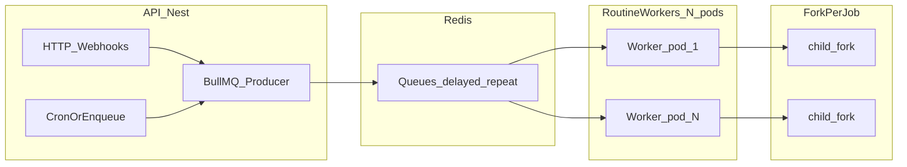
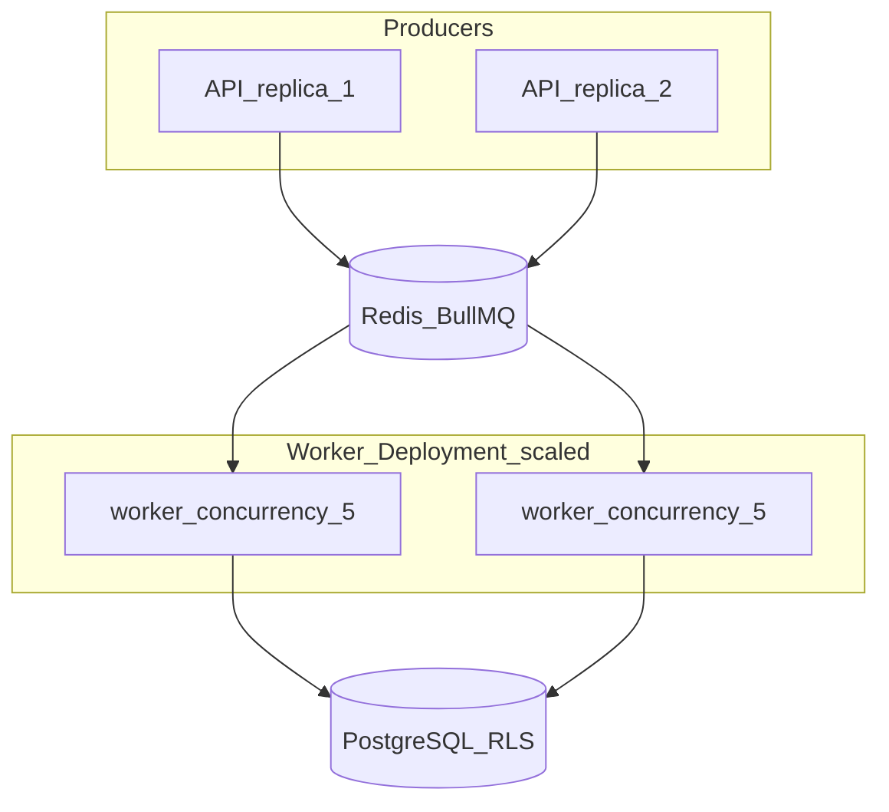

# Plano: gestão de execução de rotinas (multi-tenant, RLS, sem gargalos)

## Situação atual (webapi) — o que já ajuda e onde está o risco

**O que já isola o event loop do *user code***  
O motor executa o JS da rotina em processo filho via `fork` + [process-manager.ts](webapi/src/rotina/engine/process-manager.ts) e [routine-runner.ts](webapi/src/rotina/engine/routine-runner.ts). O trabalho CPU-bound do script roda fora do processo HTTP principal.

**Onde ainda há pressão no processo da API (e no Postgres)**

1. **RPC no processo pai** — Cada `db.query` / `hardware.exec` do filho vira mensagem IPC e `await rpcHandler(...)` no handler de `child.on('message')`. Isso não “trava” o loop como `while(true)`, mas **multiplica corrotinas e uso do pool de conexões do Prisma** no mesmo processo que atende HTTP, IA, ControlId, etc. Muitas rotinas simultâneas → muitas queries concorrentes → latência e risco de esgotar conexões.
2. **Concorrência ilimitada**
  - **Cron**: [scheduler.service.ts](webapi/src/rotina/scheduler.service.ts) dispara `executionService.execute` diretamente em cada tick, sem fila nem teto global.  
  - **Webhook assíncrono**: [rotina-webhook.controller.ts](webapi/src/rotina/rotina-webhook.controller.ts) chama `execute` sem `await` — qualquer volume de webhooks pode abrir **N processos filhos** ao mesmo tempo.  
  - **Sobreposição de cron**: dois disparos no mesmo horário (ou execução longa + próximo tick) podem **empilhar execuções da mesma rotina**, sem política explícita.
3. `**buildContext` pesado no caminho quente** — [execution.service.ts](webapi/src/rotina/engine/execution.service.ts) faz várias queries Prisma **antes** do `fork`. Com muitas execuções paralelas, isso amplia o custo no processo API.
4. **Estado de execução e cancelamento**
  - Log só é gravado ao **fim** em `ROTExecucaoLog` ([schema](webapi/prisma/schema.prisma): `SUCESSO` | `ERRO` | `TIMEOUT` — **não existe `EM_EXECUCAO` nem `CANCELADO`**).  
  - `ProcessManager.killProcess(executionId)` existe, mas **não é provider Nest** — é instanciado **dentro** do construtor de `ExecutionService` (`new ProcessManager()`), então não há um **registro único** nem API para “stop” por `executionId`.  
  - `executeManual` não devolve um identificador estável de execução para o cliente correlacionar com log/WebSocket ([rotina.service.ts](webapi/src/rotina/rotina.service.ts)).
5. **Escalabilidade horizontal (réplicas)**
  Cada instância Nest carrega **os mesmos** `CronJob` em memória (`onModuleInit` → `loadActiveRoutines`). Com 2+ pods sem coordenação, **o mesmo cron pode executar em duplicidade**.
6. **Detalhe de robustez** — Em [process-manager.ts](webapi/src/rotina/engine/process-manager.ts), `exit` e `message` podem interagir; vale garantir **uma única resolução** por `executionId` (guard flag) ao endurecer o fluxo.

---

## Objetivos do desenho

- **Teto e fila** de execuções para não saturar CPU do host, filhos OS e pool Prisma no processo API.  
- **Não empilhar** execuções da **mesma rotina** por padrão (ou política configurável: `skip` vs `queue`).  
- **Persistir** “está rodando” com **ID de execução** correlacionável (UI, API, logs).  
- **Cancelar** execução em andamento (`SIGKILL` no child + estado final `CANCELADO` / `INTERROMPIDO`).  
- **Fase alvo em produção**: **Redis + BullMQ**: API só **enfileira**; **N instâncias de worker** consomem jobs, concentram `fork` + RPC Prisma, escalam independente do HTTP.

---

## Fase 3 (detalhada) — Workers dedicados com Redis (BullMQ)

### Resposta direta: o worker pode ter várias instâncias?

**Sim — esse é o modelo esperado.** Várias réplicas do mesmo processo “routine-worker” conectam ao **mesmo Redis** e registram-se como **consumidores** da mesma fila. O BullMQ garante que **cada job é entregue a no máximo um worker por vez** (lock no Redis). Assim:

- **Escalar workers** = aumentar throughput de execuções e de `fork`s, **sem** multiplicar cron duplicado na API (desde que a **produção** do job seja idempotente — ver cron abaixo).
- A **concorrência global** efetiva será, em primeira aproximação, **soma** do parâmetro `concurrency` de cada pod × número de pods (ex.: 3 pods × `concurrency: 5` → até 15 jobs rotineiros ativos em paralelo, limitados também por CPU/RAM do cluster).

Limites operacionais a planejar em conjunto:

- **Conexões PostgreSQL**: cada worker tem um pool Prisma; N pods × pool ≤ capacidade do PG.
- **Filhos OS**: cada job ativo ≈ 1 processo filho; ulimit e memória do nó.
- **Redis**: throughput e memória para filas, locks e eventos.

### Forma do “projeto” worker no repositório

Três opções usuais (escolher uma e manter consistente em CI/CD):

1. **Pasta irmã** `routine-worker/` na raiz do monorepo (ao lado de `webapi/`), com `package.json` próprio, `Dockerfile` próprio e dependências `bullmq`, `ioredis`, `@prisma/client`, etc. **Vantagem**: deploy e escala independentes óbvios.
2. **Segundo entrypoint dentro de `webapi/`**, por exemplo `src/worker/main.ts` + script `npm run start:worker`; **duas imagens** Docker a partir do mesmo build (target multi-stage ou ARG). **Vantagem**: um único pacote, schema Prisma único.
3. **Pacote compartilhado** `packages/routine-core/` com lógica pura de execução (buildContext + processManager + tipos de job) importada por `webapi` (producer + modo legado) e `routine-worker` (consumer). **Vantagem**: menos duplicação; **custo**: extrair interfaces com cuidado.

Recomendação prática: começar com **(2)** ou **(1)** conforme já organizam `projects/`; evoluir para **(3)** se o núcleo de execução duplicar demais.

### Papéis: API vs worker

| Componente         | Responsabilidade                                                                                                                                                                                                                                                                                                                       |
| ------------------ | -------------------------------------------------------------------------------------------------------------------------------------------------------------------------------------------------------------------------------------------------------------------------------------------------------------------------------------- |
| **webapi**         | Autenticação webhook (quando aplicável); validação de tenant; **criar** `ROTExecucaoLog` `EM_EXECUCAO` + `EXEIdExterno`; **adicionar job** na fila com payload mínimo serializável; responder rápido (`202` + `exeId`). Opcional: **cron leve** que só faz `Queue.add` + **distributed lock** para não duplicar entre réplicas da API. |
| **Redis**          | Fila BullMQ; atrasos; retries; metadados de job; suporte a **repeatable jobs** (alternativa ao `node-cron` por rotina).                                                                                                                                                                                                                |
| **routine-worker** | `Worker` BullMQ com `concurrency` configurável; para cada job: carregar rotina/código, `buildContext`, `fork`, RPC no **mesmo processo do worker** (Prisma com RLS como hoje); ao terminar, **atualizar** log; erros/timeout mapeados para status final.                                                                               |

Fluxo mental: **o event loop da API deixa de orquestrar `fork` e RPC pesado**; só publica trabalho. O gargalo de RPC shifta para os **workers**, que você dimensiona à parte.

### Contrato do job (payload)

Campos mínimos sugeridos (JSON):

- `exeId` (UUID) — correlaciona DB, API, UI e cancelamento.
- `rotinaCodigo`, `instituicaoCodigo`.
- `trigger`: `SCHEDULE`  `WEBHOOK`  `MANUAL`.
- `requestEnvelope`: corpo serializável do webhook / flags manual (o que hoje vai em `requestData`).
- `enqueuedAt`, opcional `correlationId` para logs.

Não colocar no payload: referências a objetos vivos, funções ou parte do código JS (o worker **relê** `ROTCodigoJS` do banco no início do job para evitar payload gigante e garantir versão coerente com o que será executado — alinhado ao comportamento “executa versão salva”).

### Filas e nomes

- **Fila principal**: ex. `rotina-execute` (Queue BullMQ).
- **Opcional fila baixa prioridade**: webhooks “assíncronos” volumosos vs. manual interativo (priorities BullMQ).
- **Cron / agendamento**:
  - **Opção A**: manter `CronJob` na API mas cada tick só faz `Queue.add` com **jobId idempotente** (`repeat-${ROTCodigo}-${bucketMinuto}`) ou lock Redis “ só um produtor”.
  - **Opção B (preferida em escala)**: **Repeatable job** BullMQ por rotina (cadastrado quando rotina é salva/atualizada); um **único conjunto de workers** consome; sem N cópias do cron por réplica de API.

### Cancelamento (stop/kill) com worker remoto

Como o processo filho roda **no worker**, a API não chama `kill` local.

Padrão recomendado:

1. API recebe `POST .../cancel`: marca no Postgres (`EXEStatus` pendente de cancel **ou** coluna `EXECancelRequestedAt`) **e** publica evento no Redis (canal `rotina:cancel`) com `exeId` **ou** usa `bullmq` Flow / job data consultável.
2. Cada worker mantém um **mapa in-memory** `exeId → ChildProcess` (igual ao `ProcessManager` atual).
3. Ao publicar evento, o worker que possui o mapa aplica `SIGKILL`, atualiza log `CANCELADO`, e remove listeners.

Jobs **ainda na fila** (não ativos): API pode `job.remove()` pela fila BullMQ usando `jobId` = `exeId` se você definir assim na produção.

### Observabilidade

- Métricas: fila waiting/active/failed, tempo médio na fila, jobs/s por worker.
- Logs estruturados com `exeId`, `rotinaCodigo`, `instituicaoCodigo`, `workerInstanceId` (hostname ou pod name).

### Deploy

- **Deployment Kubernetes** (ou equivalente): um `Deployment` para `webapi` (HPA por CPU/RAM HTTP) e outro `Deployment` para `routine-worker` (HPA por **tamanho de fila** custom metric ou CPU se proxy).
- Variáveis: `REDIS_URL`, `DATABASE_URL`, mesmas regras RLS que a API (mesmo middleware Prisma / `SET app.current_tenant`).

---

### Transição a partir do estado atual

1. **Fase 1–2** podem ser implementadas **in-process** na API (status, cancel local, mutex) para entregar valor rápido.
2. Introduzir **feature flag** `ROTINA_USE_QUEUE=true`: quando ligado, `ExecutionService` delega a `Queue.add` e retorna `exeId`; quando desligado, comportamento atual (útil para dev sem Redis).
3. Subir **primeiro worker** com `concurrency` baixo; monitorar pool PG e latência de fila.
4. Desligar execução direta em produção após validar paridade de logs e console distribuído (**Redis adapter** + bridge de logs do worker — seções acima).

---

## Fase 1 — Fundação: identidade da execução, status e stop (baixo risco, alto valor)

### 1.1 Modelo de dados

- Estender `StatusExecucao` no [schema.prisma](webapi/prisma/schema.prisma) com pelo menos: `EM_EXECUCAO`, `CANCELADO` (e, se quiser distinguir timeout explícito de kill manual, pode mapear kill para `CANCELADO` e manter `TIMEOUT` só para watchdog).  
- Em `ROTExecucaoLog` (ou tabela irmã enxuta `ROTExecucaoAtiva` — opcional), adicionar:
  - `**EXEIdExterno`** (UUID/string única) — retornada ao cliente e usada no WebSocket.  
  - `EXEStatus` passa a permitir `EM_EXECUCAO` com `EXEFim` nulo até conclusão.
- Criar registro **no início** de `ExecutionService.execute`: `create` com `EM_EXECUCAO`, `EXEInicio`, `EXETrigger`, metadados mínimos; **no fim** (ou kill): `update` com status final, `EXEFim`, `EXEDuracaoMs`, resultado/erro/logs.

### 1.2 `ProcessManager` como serviço Nest singleton

- Registrar `ProcessManager` em [rotina.module.ts](webapi/src/rotina/rotina.module.ts) e injetar em `ExecutionService` em vez de `new ProcessManager()`.  
- Manter `Map<exeId, ChildProcess>` e expor métodos: `register`, `kill`, `getActiveForRotina`, `activeCount`.

### 1.3 API de cancelamento

- Novo endpoint (ex.: `POST instituicao/:tid/rotina/:id/execucoes/:exeId/cancel`) com JWT + escopo instituição; valida que o log existe, está `EM_EXECUCAO`, pertence à rotina/tenant; chama `processManager.kill(exeId)` e atualiza log para `CANCELADO`.  
- Opcional: endpoint `GET .../execucoes/:exeId` para polling.

### 1.4 Resposta das execuções

- `executeManual`, e webhook **assíncrono**, devem retornar `**exeId`** (e opcionalmente URL de status) imediatamente quando o modo for “fire-and-forget”; modo síncrono pode continuar aguardando o `fork` mas ainda assim logar `EM_EXECUCAO` no start.

### 1.5 WebSocket

- Ajustar [console.gateway.ts](webapi/src/rotina/console.gateway.ts) (se necessário) para emitir `exeId` junto com `executionId` legado, para a UI do [webapp](webapp) poder chamar cancel.

---

## Fase 2 — Concorrência: uma rotina não “engole” a outra (nem a si mesma)

### 2.1 Exclusão por rotina (overlap)

- Antes de `fork`, consultar: existe `ROTExecucaoLog` com `EXEStatus = EM_EXECUCAO` para **este `ROTCodigo`**?  
  - **Política default**: recusar com 409 ou enfileirar (recomendo **recusar** no MVP com mensagem clara; fila vem na 2.3).
- Para cron: se o tick anterior ainda está em execução, **não iniciar** outra (mesma verificação).

### 2.2 Teto global de execuções simultâneas

- Introduzir um **semáforo** (ex.: `p-limit` ou implementação simples com contador + fila em memória) **no processo**:  
  - `maxConcurrentRoutineForks` via env (`ROTINA_MAX_CONCURRENT`, ex. 5–20 conforme RAM/CPU).  
  - Ao exceder: webhook async pode responder `202` + `exeId` enfileirado **ou** erro `503` com retry — decisão de produto; fila persistente é Fase 3.

### 2.3 Fila enxuta (opcional dentro da Fase 2)

- Fila in-process: lista de jobs `{ exeId, rotinaId, tenantId, trigger, payload }` consumida por até N workers que chamam o mesmo `ExecutionService` — evita explosão de filhos quando há pico.

### 2.4 RPC / Prisma

- Documentar e monitorar: **tamanho do pool** Prisma vs `maxConcurrent`.  
- Se RPC for gargalo: limitar concorrência de RPC por execução (raro) ou mover worker para processo separado (Fase 3).

---

## Fase 3 (resumo) — Produção multi-réplica

O detalhamento de **workers com Redis**, **múltiplas instâncias**, payload, cancelamento e WebSocket está na seção **“Fase 3 (detalhada) — Workers dedicados com Redis (BullMQ)”** acima.

Pontos compactos:

- **Cron distribuído**: preferir **enqueue único** (lock Redis ou repeatable BullMQ) para não duplicar ticks entre réplicas da API.
- **API**: produtora da fila; **workers**: únicos que executam `fork` + RPC contra o Postgres com RLS.

---

## Ordem de implementação sugerida

1. Schema + migração (`EM_EXECUCAO`, `CANCELADO`, `EXEIdExterno`).
2. Persistir início/fim + refatorar `ProcessManager` para provider + mapa global.
3. Retornar `exeId` nas APIs + cancel endpoint + testes manuais (manual + webhook async).
4. Mutex “uma execução ativa por rotina” + teto global `maxConcurrent`.
5. Observabilidade: métricas (`active_forks`, `queue_depth`, duração RPC), logs estruturados.
6. Se necessário multi-réplica ou pico alto: fila Redis + worker + lock de cron.

---

## Riscos e decisões explícitas

- **Kill** = `SIGKILL` no child: não há “cleanup” cooperativo no JS da rotina; documentar.  
- **Webhook síncrono** continua preso ao tempo **total** (fila + execução): a requisição HTTP aguarda o job no BullMQ; dimensionar timeouts e concorrência. Para integrações externas “fire-and-forget”, preferir modo assíncrono ou callback outbound.  
- **RLS**: garantir que criação/atualização do log de execução use sempre `INSInstituicaoCodigo` coerente com o tenant da requisição (já alinhado ao padrão atual).

