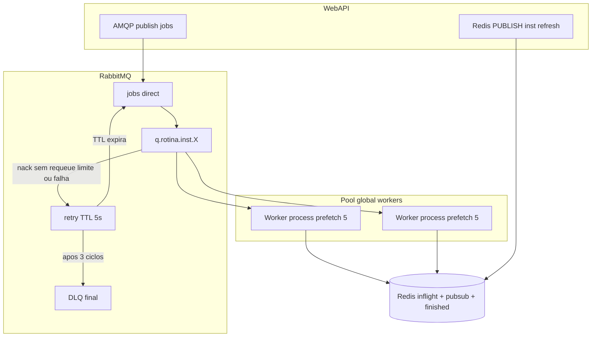

# Plano: jobs por instituição com RabbitMQ + pool global de workers

## Contexto no repositório

- **Enqueue hoje**: `[webapi/src/rotina/queue/rotina-queue.service.ts](webapi/src/rotina/queue/rotina-queue.service.ts)` cria `ROTExecucaoLog` e enfileira Bull `rotina-execute`.
- **Consume hoje**: `[worker/src/rotina-consumer.ts](worker/src/rotina-consumer.ts)` usa BullMQ `Worker` e `WORKER_CONCURRENCY`.
- **Webhook síncrono**: `[webapi/src/rotina/rotina-webhook.controller.ts](webapi/src/rotina/rotina-webhook.controller.ts)` usa `Queue` + `QueueEvents` + `waitUntilFinished`.
- **Cancel / fila**: `[RotinaQueueService](webapi/src/rotina/queue/rotina-queue.service.ts)`; `[rotina.service.ts](webapi/src/rotina/rotina.service.ts)`.
- **Monitor**: `[webapi/src/monitor/monitor.service.ts](webapi/src/monitor/monitor.service.ts)` usa `getJobCounts()` Bull.
- **Instituição**: `[INSInstituicao](webapi/prisma/schema.prisma)` — acrescentar `INSMaxExecucoesSimultaneas` (paridade em `[worker/prisma/schema.prisma](worker/prisma/schema.prisma)` e `[projects/remote-ui-gateway/prisma/schema.prisma](projects/remote-ui-gateway/prisma/schema.prisma)`).

## Arquitetura alvo




### Princípios

- **Pool global**: vários processos worker competem pelas mesmas filas `q.rotina.inst.`*; o Rabbit **faz round-robin** entre consumidores da mesma fila.
- **Prefetch fixo 5 por processo worker**: cada processo limita a **no máximo 5 mensagens não-ack** no total (recomenda-se `prefetch(5, global=true)` no canal que agrupa todos os `basic.consume` daquele processo — confirmar comportamento exato no `amqplib` e na versão do broker; ajustar para “5 em voo por worker” conforme teste).
- **Limite por instituição** (`INSMaxExecucoesSimultaneas`, default **8**): controle via **Redis**, contador atômico por `INSCodigo` (script Lua: só incrementa se `atual < max`; no fim do processamento `DECR` em `finally`). O valor `max` lido no momento do acquire (cache atualizado pelo refresh + fallback DB).
- **Cancelamento**: ao consumir, **antes** de contabilizar processamento de negócio, worker consulta `ROTExecucaoLog` por `exeId`; se `EXEStatus` já for **CANCELADO**, **ack** imediato e **não** incrementa Redis (e não executa rotina).
- **Redis**: `rotina:cancel`, `rotina:finished:{exeId}` (webhook síncrono), contadores `rotina:inflight:{INSCodigo}`, canal `**openturn:instituicao:queue:refresh`** (nome canônico sugerido; ajustar se já existir convenção no projeto).

## Fases de implementação

### 1) Modelo de dados

- `INSInstituicao.INSMaxExecucoesSimultaneas Int @default(8)`, com validação na API (ex.: mínimo 1, máximo política comercial).

### 2) Publish Redis `instituicao:queue:refresh` (planejamento detalhado)

**Objetivo:** workers criam/bindam novas filas e atualizam cache de limites **sem** depender só de poll longo.


| Aspecto                   | Definição                                                                                                                                                                                                                                                                                                                                                     |
| ------------------------- | ------------------------------------------------------------------------------------------------------------------------------------------------------------------------------------------------------------------------------------------------------------------------------------------------------------------------------------------------------------- |
| **Quem publica**          | Camada de serviço WebAPI após **transação** Prisma bem-sucedida em instituição: `create`, `update` relevantes (`INSMaxExecucoesSimultaneas`, `INSAtivo`, criação nova). Evitar publicar em rollback (usar após `create`/`update`, não middleware genérico frágil).                                                                                            |
| **Comando**               | `redis.publish('openturn:instituicao:queue:refresh', payload)`                                                                                                                                                                                                                                                                                                |
| **Payload (JSON string)** | `{ "INSCodigo": number, "INSMaxExecucoesSimultaneas": number, "INSAtivo": boolean, "event": "created"                                                                                                                                                                                                                                                         |
| **Quem assina**           | Cada processo worker mantém **conexão ioredis dedicada** em modo subscriber (`duplicate()`), `subscribe('openturn:instituicao:queue:refresh')`. Não reutilizar a mesma conexão de comandos Redis.                                                                                                                                                             |
| **Handler no worker**     | Debounce por `INSCodigo` (~500ms–1s): atualizar cache em memória do limite; se `INSAtivo`, `assertQueue` + `bindQueue` no Rabbit; se nova fila, registrar `consume` no canal já existente (pool global); se `INSAtivo === false`, opcionalmente `cancel` consumers só dessa fila ou deixar fila drenar e parar de publicar no exchange (política de produto). |
| **Confiabilidade**        | Pub/sub é **best-effort**; manter **poll** periódico (ex. 2–5 min) ou no boot como reconciliação com `INSInstituicao` ativas.                                                                                                                                                                                                                                 |
| **Segurança**             | Payload só com códigos internos; mesma rede Redis que já atende a API.                                                                                                                                                                                                                                                                                        |


### 3) Contrato RabbitMQ

- Exchange `**jobs`** (direct, durable).
- Fila principal `**q.rotina.inst.{INSCodigo}`** (durable), bind `jobs` / routing key `String(INSCodigo)`.
- **DLX para retry com 5s e até 3 retornos à fila principal**:
  - Padrão recomendado: fila **retry** por instituição `q.rotina.retry.{INSCodigo}` (ou uma fila retry fan-in com header; por simplicidade **por instituição** evita corrida de routing key) com `x-message-ttl: 5000`, `x-dead-letter-exchange: jobs`, `x-dead-letter-routing-key: <mesmo INSCodigo>` — mensagem expirando **republica** na fila principal.
  - Mensagens que vão à DLX: (a) **limite Redis atingido** no acquire, (b) **falha de processamento** após política local (ou direto nack sem requeue para o retry).
  - **Contagem de tentativas**: header de aplicação `**x-rotina-retry-count`** (ou `x-death` + regras); ao publicar/receber da fila principal começar em `0`; cada passagem pelo ciclo DLX→retry→TTL→jobs incrementa; se `**> 3`** (ou `>= 3` conforme convenção “até 3 reenvios”), encaminhar a **DLQ final** `q.rotina.dlq` (ou por instituição), **ack** da mensagem na fila retry, atualizar `ROTExecucaoLog` como erro definitivo.
- Mensagem: corpo JSON = `RotinaJobData`; `persistent: true`; `messageId` / `correlationId = exeId`.

### 4) WebAPI — publisher (jobs)

- Dependência `amqp-connection-manager` (ou equivalente) para reconexão.
- Substituir Bull por serviço que, após criar `ROTExecucaoLog`, faz `publish` em `jobs` com `routingKey = String(instituicaoCodigo)`.
- Webhook síncrono: assinar `rotina:finished:{exeId}` até timeout.
- **Cancel**: manter `PUBLISH rotina:cancel` com `{ exeId }`. Não depende de remover mensagem no Rabbit; **no consumo**, worker verifica cancelo no DB e dá **ack sem processar**.

### 5) Worker — orquestrador + pool global

- **Boot**: carregar instituições ativas (DB), declarar exchange, para cada uma `assertQueue` principal + **retry** + binds DLX conforme topologia acima.
- **Canal(is)**: um único canal por processo com `**prefetch(5, true)`** (global) e **vários** `consume()` — um por `q.rotina.inst.{id}` ativa; todos os workers do cluster competem nas mesmas filas.
- **Evento refresh Redis**: atualizar lista de filas/consumes e cache `max` sem restart completo (adicionar/remove consume conforme ativo).
- **Handler mensagem**:
  1. Parse + carregar `exeId`, `instituicaoCodigo`.
  2. Se log em DB **CANCELADO** → `ack`, return.
  3. **Lua Redis**: se `inflight < INSMaxExecucoesSimultaneas` então incrementar e OK; senão FALHA → `nack(msg, false, false)` para ir ao DLX/retry (respeitando contador 3).
  4. Processar rotina (código atual extraído de `rotina-consumer.ts`); em `**finally`**: `DECR` inflight (e tratar cancel/interrupt como hoje).
  5. Sucesso: `ack`; falha de negócio transiente: mesma política DLX 5s / 3 tentativas; após esgotar → DLQ + persistir erro.

### 6) Retries unificado (limite + falha)

- **Tempo de requeue**: **5 segundos** na fila retry (TTL).
- **Tentativas**: **até 3** reenvios da deadletter/retry para a fila principal (via contador no header); na 4ª situação de falha ou após 3 ciclos completos, **DLQ final** e atualização do log.

### 7) Monitoramento

- Substituir contadores Bull por API de gestão Rabbit, métricas por fila, ou visão simplificada no painel.

### 8) Pré-produção / migração

- Produto **não** está em produção: **não** é necessário plano de drenagem da fila Bull nem feature flag `JOB_TRANSPORT`. Substituir Bull diretamente na entrega desta mudança e remover dependências/código morto associados à fila `rotina-execute`.

## Pseudocódigo (worker — núcleo)

```typescript
const REFRESH_CHAN = 'openturn:instituicao:queue:refresh';

// Uma conexão Rabbit, um canal, prefetch global 5
await channel.prefetch(5, true);

redisSub.subscribe(REFRESH_CHAN, debouncePerInst(handleRefresh, 750));

async function reconcileAllActive() {
  const insts = await prisma.iNSInstituicao.findMany({ where: { INSAtivo: true } });
  for (const inst of insts) await ensureTopologyAndConsume(channel, inst);
}

async function onMessage(msg: ConsumeMessage) {
  const data = JSON.parse(msg.content.toString());
  const { exeId, instituicaoCodigo } = data;

  const log = await prisma.rOTExecucaoLog.findFirst({ where: { EXEIdExterno: exeId } });
  if (log?.EXEStatus === StatusExecucao.CANCELADO) {
    channel.ack(msg);
    return;
  }

  const max = limitCache.get(instituicaoCodigo) ?? (await loadLimitFromDb(instituicaoCodigo));
  const acquired = await redisSemaphoreTryAcquire(instituicaoCodigo, max);
  if (!acquired) {
    if (getRetryCount(msg) >= 3) {
      await moveToFinalDlqAndFailLog(msg, data);
      channel.ack(msg);
      return;
    }
    channel.nack(msg, false, false); // vai p/ DLX → retry 5s → volta
    return;
  }

  try {
    await processRotina(data); // handler extraído do consumer atual
    channel.ack(msg);
  } catch (e) {
    if (getRetryCount(msg) >= 3) { /* DLQ + log */ channel.ack(msg); }
    else { channel.nack(msg, false, false); }
  } finally {
    await redis.incrby(`rotina:inflight:${instituicaoCodigo}`, -1);
  }
}
```

(Ajustar detalhes: incremento/decremento simétricos com Lua; `getRetryCount` baseado em header; DLQ `ack` para não reprocessar infinitamente.)

## Checklist de implementação

- Prisma `INSMaxExecucoesSimultaneas` default **8** + API
- WebAPI: implementar `publish` refresh Redis após instituição salva
- Rabbit: topologia `jobs` + principal + retry TTL 5s + DLQ + headers tentativa
- WebAPI: publisher rotina + `rotina:finished` / remover Bull
- Worker: subscriber refresh + `prefetch(5,global)` + consumes múltiplos + Lua inflight
- Worker: cancel-check DB + DLX 3x + extrair handler
- Remover Bull rotina e `QueueEvents` onde aplicável
- Testes de integração: 2 workers, 1 instituição limite 2, validar bloqueio e retry 5s

## Riscos e observações

- **Prefetch global com muitos `consume` no mesmo canal**: validar em teste de carga que o comportamento é “≤5 mensagens não ack simultâneas por processo” em toda a árvore de filas do canal.
- **Contador Redis**: crash do worker após acquire e antes de `DECR` — mitigar com TTL por “lease” opcional (`SET exeId ... EX` + reconciliação) ou aceitar desvio breve até reconciliar com DB.
- **Webhook síncrono**: dependência de Redis para `finished`; definir timeout HTTP claro.

