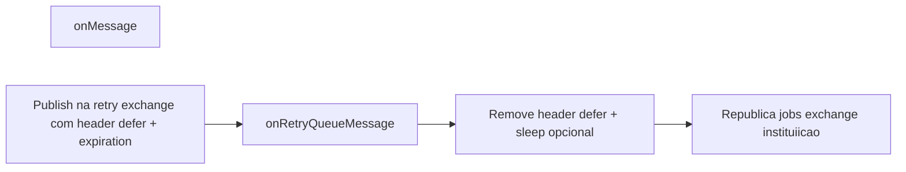

# Postergação serial sem incrementar retry

## Comportamento desejado

Quando o job não obtém o slot serial (rotina com `ROTPermiteParalelismo === false` e outra execução da mesma rotina ainda “em voo”), o processamento é **apenas postergado** — não é falha. Nesse caso, **não** deve subir a contagem de `x-rotina-retry-count`, para não atingir `MAX_RETRIES` nem ir para DLQ final por “tentativas” que na verdade foram reentradas agendadas.

## O que o código já faz

Fluxo atual em [worker/src/rotina-consumer.ts](worker/src/rotina-consumer.ts):

1. **Postergação por capacidade (instituição)** — [`republishWithCapacityDefer`](worker/src/rotina-consumer.ts) já implementa o padrão “republicar **sem** incrementar retry”: publica em `getJobsRetryExchange()` com `RETRY_DLX_ROUTING_KEY`, acrescenta [`CAPACITY_DEFERRED_HEADER`](worker/src/rotina-consumer.ts), `expiration` = `CAPACITY_DEFER_MS`. Em `onRetryQueueMessage`, o ramo `isCapacityDeferred` aplica sleep, remove o header e republica na exchange principal preservando headers (incluindo `RETRY_HEADER`).

2. **Postergação serial** — [`republishWithDelay`](worker/src/rotina-consumer.ts) é o mesmo padrão de transporte (mesma exchange, mesma routing key, TTL no `expiration`), apenas com headers `x-serial-delayed` / `x-serial-inst`. O ramo correspondente em `onRetryQueueMessage` republica sem incrementar, como o da capacidade.

3. **Republicação direta ao tenant (sem passar pela fila global)** — [`republishToTenantMainQueue`](worker/src/rotina-consumer.ts) documenta explicitamente que **preserva** `RETRY_HEADER` — não conta como nova tentativa. Usado quando `CAPACITY_DEFER_MS === 0` no ramo sem vaga no semáforo por instituição.

Ou seja, **o método/caminho que “já faz republish sem incrementar”** neste arquivo é esse conjunto: **publish deferido pela fila global** (capacity ou serial, ambos tratados antes do incremento em `onRetryQueueMessage`), ou **`republishToTenantMainQueue`** quando o defer configurável está desligado.

## Possível causa se ainda houver incremento indevido

A condição atual para serial usa **`x-serial-delayed === true`** (estrita). Se o broker/amqplib entregar o valor de outra forma, o código pode cair no trecho genérico que incrementa `RETRY_HEADER`. Isso pode ser tratado **depois**, com uma checagem defensiva mínima no **mesmo** ramo já existente — sem obrigar nova infra de constantes como item principal do plano.

## Ações propostas (implementação posterior)

1. **Reutilizar o padrão já existente** — Não introduzir um fluxo novo para “não incrementar”. Consolidar `republishWithDelay` e `republishWithCapacityDefer` num **único método privado** (por exemplo `republishDeferredThroughGlobalRetry(ch, msg, options: { deferHeader: string; expirationMs: number; extraHeaders?: Record<string, unknown> })`), ou fazer um delegar ao outro, de modo que serial e capacidade compartilhem o mesmo publish e o mesmo contrato com `onRetryQueueMessage`.

2. **Manter `onRetryQueueMessage`** com dois ramos explícitos (serial vs capacity) **antes** do `prev + 1`, ou unificar num ramo genérico “mensagem deferida” que lê o header a partir da mesma constante usada no publish — desde que a detecção continue ocorrendo **antes** do incremento.

3. **Opcional** — Se após unificação ainda houver falha de branch, alinhar a detecção do header ao mesmo estilo usado em `isCapacityDeferred` (ou uma função mínima compartilhada entre os dois ramos), sem expandir escopo além disso.

4. **Verificação** — Smoke manual ou teste: postergação serial não altera `x-rotina-retry-count`.

## Fora do escopo

- Alterar `MAX_RETRIES`, DLQ final ou o fluxo de `nack` por **erro real** de execução (esses devem continuar incrementando).
- Mudança na topologia Rabbit — não é necessária se o publish continuar igual ao de `republishWithCapacityDefer`.
