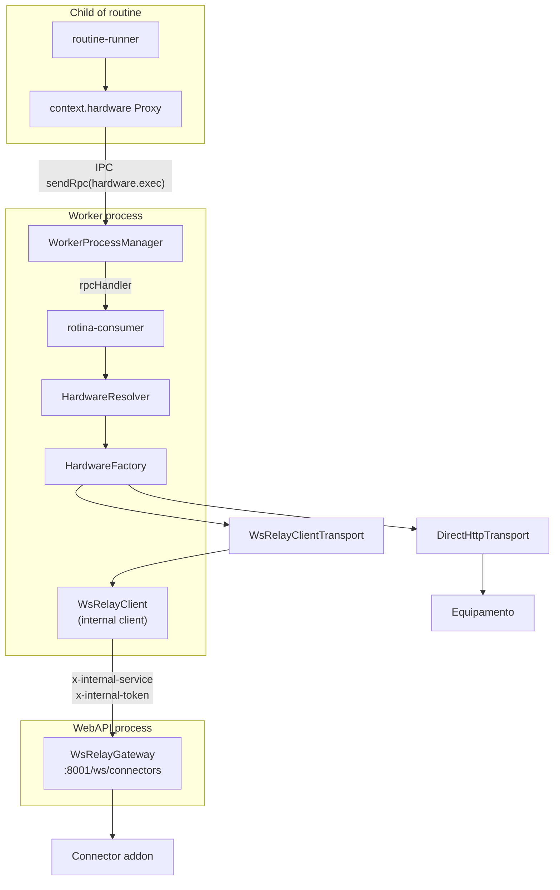

# Habilitar `context.hardware.xxx` no worker (replicação local de providers)

## Objetivo

Quando o código de uma rotina chamar `await context.hardware.<metodo>(equipmentId, ...args)` dentro do filho `routine-runner.js`, o RPC `hardware.exec` deve ser tratado pelo worker resolvendo o `IHardwareProvider` correto (pessoas, tags, face, biometria, grupos/departamentos via `setGroups`/`removeGroups` e campo `grupo`, `applyEquipmentConfiguration`, `customCommand`, `executeAction`, `enroll`, `testConnection`, `syncPerson`).

A estrutura é replicada (sem decorators do NestJS) em `worker/src/hardware/`, espelhando [webapi/src/hardware](webapi/src/hardware).

## Arquitetura



Hoje o proxy `context.hardware` já existe no [worker/src/engine/routine-runner.ts](worker/src/engine/routine-runner.ts) (linhas 21 e 68-76) e envia `sendRpc('hardware.exec', { equipmentId, method, args })`, mas o `rpcHandler` em [worker/src/rotina-consumer.ts](worker/src/rotina-consumer.ts) (linhas 711-719) só trata `db.query`. O plano completa esse handler, criando toda a infra de providers.

## O que será criado em `worker/src/hardware/` (mirror)

Arquivos espelhados (cópias adaptadas, sem `@Injectable`/`Logger` do Nest, sem `PrismaService`):

- `interfaces/`
  - `hardware-provider.interface.ts` (cópia)
  - `hardware-equipment-config.interface.ts` (cópia)
  - `hardware.types.ts` (cópia)
- `transport/`
  - `http-transport.interface.ts` (cópia)
  - `direct-http.transport.ts` (cópia — usa `axios` que já é dependência do worker)
  - `ws-relay-client-http.transport.ts` (NOVO — assina `IHttpTransport`, mas usa `WsRelayClient` em vez de `WsRelayGateway`)
- `relay/ws-relay-client.ts` (NOVO — cliente WS singleton)
- `factory/`
  - `brand-factory.interface.ts` (cópia)
  - `hardware.factory.ts` (cópia adaptada)
- `brands/controlid/`
  - `controlid.factory.ts`, `controlid.types.ts` (cópias adaptadas)
  - `abstract/controlid.abstract.ts` (cópia adaptada — substituir `@Injectable` Logger por logger plano)
  - `models/*.provider.ts` (cópias: default, idblock, idblock-next, idblock-facial, idfacemax, idface)
  - `utils/*.ts` (cópias: catra-event, notify-time)
- `brands/hikvision/`, `brands/intelbras/`, `brands/topdata/`
  - `*.factory.ts`, `abstract/*.abstract.ts`, `models/*-default.provider.ts`, `*.types.ts` (quando houver)
- `hardware-resolver.ts` (NOVO — substitui `HardwareService.executeProviderAction`)

**Não** serão replicados (são specifics da webapi e não fazem parte do contrato `IHardwareProvider`):

- `webapi/src/hardware/controllers/*`
- `webapi/src/hardware/dto/*`
- `webapi/src/hardware/brands/controlid/services/*` (monitor, passagem, sync, command-queue, resolver)
- `webapi/src/hardware/brands/controlid/controllers/*`

## Adaptações para des-Nestificar

- Trocar `import { Injectable, Logger } from '@nestjs/common'` por classe `Logger` simples (`console.log` com prefixo) ou aproveitar `workerLogLine` de [worker/src/worker-log.ts](worker/src/worker-log.ts).
- Trocar `PrismaService` por `PrismaClient` (já é o que o worker usa em [worker/src/prisma.ts](worker/src/prisma.ts)).
- Remover `@Injectable()` e injeção de dependência via construtor explícito.
- `BadRequestException`/`NotFoundException` viram `Error` plano (mensagens preservadas).
- `ConnectorService.findByInstituicao` substituído por consulta Prisma direta dentro do `WsRelayClientTransport`/factory.

## Conectividade WebSocket (sem duplicar a infra de connectors)

`worker/src/hardware/relay/ws-relay-client.ts`:

- Conecta a `ws://${WEBAPI_WS_HOST}:${WEBAPI_WS_PORT}/ws/connectors` com headers:
  - `x-internal-service: openturn-worker`
  - `x-internal-token: ${RELAY_INTERNAL_TOKEN}` (mesma env que a webapi já valida)
- Mantém reconnect com backoff, heartbeat (PING) e tabela `pendingRequests` por `requestId` (mesmo protocolo de [webapi/src/connector/ws-relay.gateway.ts](webapi/src/connector/ws-relay.gateway.ts) — ver `routeGatewayRequest`, linha 259-286).
- Expõe `sendHttpRequest(tenantId, equipId, baseUrl, method, path, headers, body, timeoutMs)` retornando `{ statusCode, headers, body }`.
- Singleton instanciado em [worker/src/main.ts](worker/src/main.ts) e propagado para `startConsumer`.

`worker/src/hardware/transport/ws-relay-client-http.transport.ts`:

- Implementa `IHttpTransport.post(path, body, headers)`.
- Recebe `wsRelayClient`, `tenantId` (instituicaoCodigo), `equipId`, `baseUrl`.
- Serializa o body (Buffer/string/JSON), chama `wsRelayClient.sendHttpRequest(...)` e converte o response para `{ data }` igual ao [webapi/src/hardware/transport/ws-relay-http.transport.ts](webapi/src/hardware/transport/ws-relay-http.transport.ts).

Diferença chave do existente: o transport do worker passa **`tenantId` (instituicaoCodigo)** em vez de `connectorId` — porque `routeGatewayRequest` na webapi roteia por tenant (linha 260-269), o que evita o worker precisar consultar `CONConnector`.

## `HardwareResolver` (worker/src/hardware/hardware-resolver.ts)

Substitui `HardwareService.executeProviderAction`:

```ts
export class HardwareResolver {
  constructor(
    private readonly prisma: PrismaClient,
    private readonly factory: HardwareFactory,
    private readonly instituicaoCodigo: number,
  ) {}

  async exec(equipmentId: number, method: keyof IHardwareProvider, args: any[]) {
    const device = await this.prisma.eQPEquipamento.findFirst({
      where: { EQPCodigo: equipmentId, INSInstituicaoCodigo: this.instituicaoCodigo },
    });
    if (!device) throw new Error(`Equipment ${equipmentId} not found in tenant ${this.instituicaoCodigo}`);
    const provider = await this.factory.resolve(device);
    if (typeof provider[method] !== 'function') {
      throw new Error(`Method ${String(method)} not implemented for ${device.EQPMarca}`);
    }
    return await (provider[method] as any)(...args);
  }
}
```

Pontos:

- Filtra por `INSInstituicaoCodigo` (mesma proteção de tenant do `db-tenant-proxy`).
- Whitelist implícita pelo `typeof === 'function'`; opcionalmente, validar contra um `Set` com os métodos do `IHardwareProvider` para bloquear `__proto__` etc.

## Wiring no consumer

Em [worker/src/rotina-consumer.ts](worker/src/rotina-consumer.ts):

1. `startConsumer` recebe `wsRelayClient` (novo parâmetro) — inicializado em [worker/src/main.ts](worker/src/main.ts).
2. `buildContext()` cria `HardwareResolver(prisma, hardwareFactory, instituicaoCodigo)`. A `hardwareFactory` é instanciada uma vez no nível do consumer com `wsRelayClient` injetado (singleton).
3. No `rpcHandler`, adicionar:

```ts
if (method === 'hardware.exec') {
  const { equipmentId, method: providerMethod, args } = params;
  return resolver.exec(equipmentId, providerMethod, args);
}
```

## Variáveis de ambiente novas no worker

- `WEBAPI_WS_URL` (ex.: `ws://localhost:8001/ws/connectors`) — ou `WEBAPI_WS_HOST` + `WEBAPI_WS_PORT`.
- `RELAY_INTERNAL_TOKEN` — mesmo valor do `.env` da webapi.

## Riscos e considerações

- **Schema Prisma sincronizado**: o worker já roda `prisma:sync` ([worker/package.json](worker/package.json) linha 11). Acessar `EQPEquipamento`, `PESPessoa`, `PESEquipamentoMapeamento` etc. funciona sem mudanças.
- **Estado em memória**: `controlid.abstract.ts` mantém `session` por instância — cada execução de rotina cria seu próprio provider via `factory.resolve`, então sessão é por execução (mesmo comportamento da webapi atual, que também instancia por chamada).
- **Equipamentos com `EQPUsaAddon=true`**: dependem do connector estar online na webapi. O `WsRelayClient` propaga o erro `Connector not connected for this tenant` igual hoje.
- **Sem hot-reload de código de provider**: alterações em providers exigem mudar nos dois lugares até alguma futura extração para pacote compartilhado (registrado como dívida técnica).
- **Tamanho da replicação**: ~2.000 linhas de código duplicado (providers + abstracts + transports). Confirmado escolha B do usuário.

## Critérios de aceitação

- Em uma rotina, `await context.hardware.syncPerson(eqp, { id: 1, name: 'Foo' })` executa o mesmo fluxo que o `HardwareService` da webapi.
- `await context.hardware.testConnection(eqp)` retorna `{ ok, deviceId?, info?, error? }`.
- Equipamentos `EQPUsaAddon=true` funcionam via WS relay (worker como cliente interno) sem rodar o WS Gateway dentro do worker.
- Acessos cross-tenant (equipamento de outra instituição) são bloqueados com erro `Equipment X not found in tenant Y`.
- Métodos não previstos no contrato lançam `Method foo not implemented for <marca>`.