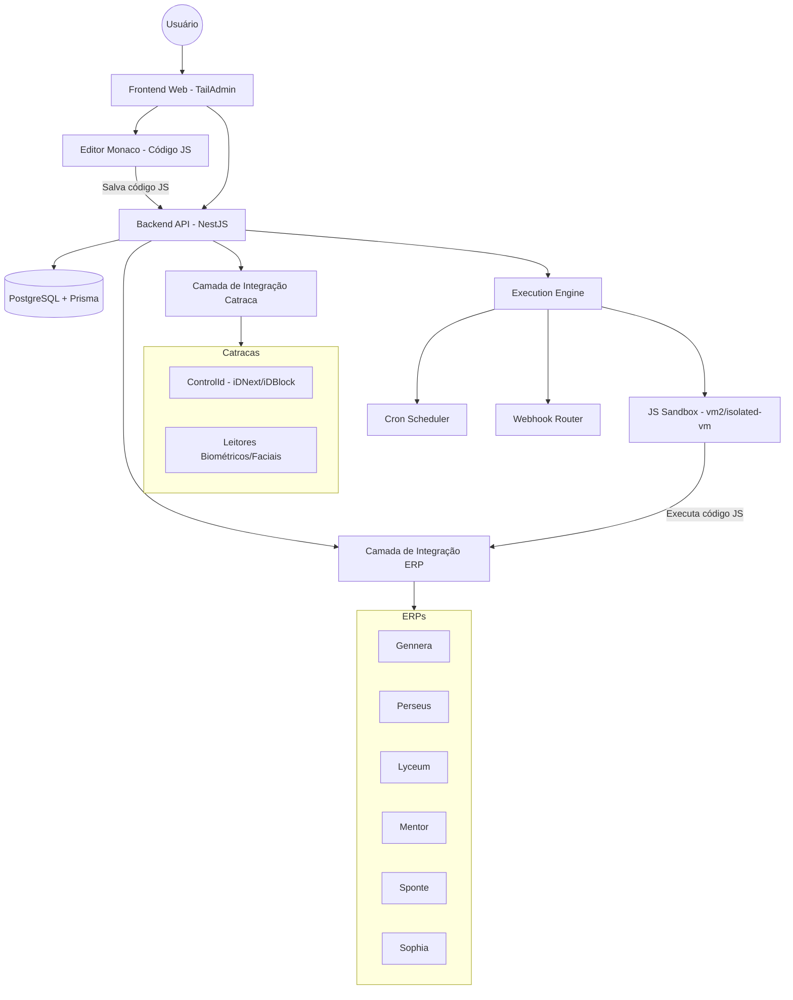

# Documentação de Arquitetura - Middleware OpenTurn

O OpenTurn é um middleware desenvolvido para conectar ERPs Educacionais e Sistemas de Controle de Acesso Físico (Catracas). Utiliza uma estrutura multi-tenant onde a navegação e o acesso aos dados são isolados por instituição.

## Visão Geral do Sistema

O OpenTurn segue uma abordagem de Arquitetura Limpa (Clean Architecture) com uma camada de integração modular.

## Camadas

### 1. Frontend (Webapp)
- **Framework**: Next.js
- **Template**: TailAdmin
- **Navegação**: Baseada em `:codigoInstituicao` (ex: `/instituicao/123/dashboard`).
- **Gerenciamento de Estado**: Context API / Hooks para o contexto do tenant.
- **Editor de Código**: Monaco Editor integrado para escrita de rotinas JavaScript.

### 2. Backend Core (NestJS)
- **Framework**: NestJS v11+
- **Runtime**: Node.js v24.13.0
- **Responsabilidades**:
    - Autenticação e Autorização (ciente de RLS).
    - Gerenciamento de Contexto de Tenant.
    - Lógica de Negócio Central (Pessoas, Matrículas).
    - Despacho para Módulos de Integração.
    - **Execution Engine** (Rotinas dinâmicas + Webhooks).

### 3. Camada de Banco de Dados (PostgreSQL + Prisma)
- **ORM**: Prisma
- **Estratégia**: Segregação por Row-Level Security (RLS) baseada em `codigoInstituicao`.
- **Controle de Tenant**: Todo registro (exceto entidades globais) deve ter uma coluna `codigoInstituicao`.

### 4. Camada de Integração (Modular)
- **ERPs**: Adaptadores para cada sistema educacional. Gerencia a sincronização de alunos, cursos e turmas.
- **Catracas**: Adaptadores para comunicação com hardware. Suporta ControlId (iDNext, iDBlock) e biometria facial.

### 5. Execution Engine (Rotinas & Webhooks)
Motor de execução dinâmica que permite criar rotinas JavaScript por instituição.

#### Tipos de Rotina
| Tipo | Trigger | Descrição |
|------|---------|-----------|
| **Schedule** | Cron Expression | Executa automaticamente segundo a expressão cron definida |
| **Webhook** | HTTP Request | Executa quando recebe uma chamada HTTP no path configurado |

#### Fluxo de Criação
1. Gestor acessa a tela de Rotinas no frontend.
2. Cria uma nova rotina (Schedule ou Webhook).
3. Escreve o código JavaScript no **Monaco Editor**.
4. Define os parâmetros (cron expression OU método HTTP + path).
5. Salva → código é gravado na tabela `ROTRotina` no banco.

#### Execução Schedule (CronJob)
- O `CronScheduler` do NestJS (`@nestjs/schedule`) carrega todas as rotinas ativas do tipo `SCHEDULE`.
- No momento definido pela expressão cron, executa o código JS em uma **sandbox isolada** (`vm2` ou `isolated-vm`).
- O resultado (sucesso/erro) é gravado na tabela `ROTExecucaoLog`.

#### Execução Webhook
- URL base fixa: `/instituicao/:codigoInstituicao/webhook/:path`
- O `WebhookRouter` dinâmico intercepta requisições nesse padrão.
- Busca a rotina correspondente ao `path` + `método HTTP` configurado.
- Executa o código JS na sandbox, injetando:
  - `request.body` — corpo da requisição
  - `request.params` — query parameters
  - `request.path` — path completo
  - `request.method` — método HTTP (GET, POST, PUT, PATCH)
- O retorno da função JS é enviado como response da requisição.

#### Sandbox de Execução (Segurança)
| Regra | Descrição |
|-------|-----------|
| **Isolamento** | Código roda em VM isolada (sem acesso ao filesystem do servidor) |
| **Timeout** | Execução limitada a 30s (configurável por rotina) |
| **Contexto injetado** | Apenas APIs aprovadas: `fetch`, `console.log`, adaptadores ERP |
| **Logs** | Toda execução gera registro em `ROTExecucaoLog` |

## Grupos de Acesso de Usuários
| Grupo | Escopo | Permissões |
| --- | --- | --- |
| **Super Root** | Global | Controle total + criação de Clientes/Instituições. |
| **Super Admin** | Global | Visão de suporte (Todos Clientes/Instituições), sem criação. |
| **Admin** | Cliente | Todas as configurações dentro de um Cliente específico. |
| **Gestor** | Instituição | Acesso total a uma Instituição específica. |
| **Operação** | Instituição | Consultas, cadastro de pessoas, captura de biometria/tag. |
