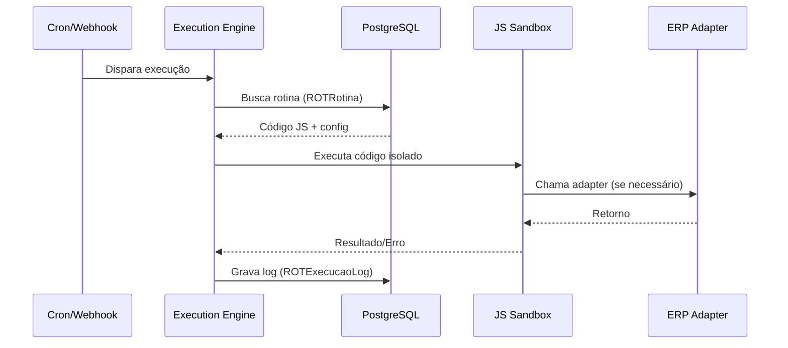

# Módulos de Integração - OpenTurn

Para suportar múltiplas marcas de hardware (Catracas) e diferentes sistemas educacionais (ERPs) mantendo a lógica central estável, o OpenTurn utiliza uma arquitetura modular baseada em adaptadores.

## 1. Camada de Integração ERP

Cada ERP possui suas especificidades em termos de endpoints de API, autenticação e estruturas de dados.

### Sistemas Suportados:
- Gennera
- Perseus
- Lyceum
- Mentor
- Sponte
- Sophia

### Arquitetura:
Utilizamos o **Padrão Strategy**. O serviço central chama um `ErpIntegrationProvider` que delega para o adaptador específico.

```typescript
interface IErpAdapter {
  syncStudents(institutionCode: string): Promise<void>;
  syncClasses(institutionCode: string): Promise<void>;
  validateCredentials(config: any): Promise<boolean>;
}

// Exemplo de adaptadores: GenneraAdapter, PerseusAdapter, etc.
```

## 2. Camada de Integração de Catraca

A comunicação com hardware requer protocolos específicos (HTTP, Socket, SDKs).

### Modelos Suportados (ControlId):
- **iDNext**: (iDNext, iDNext+iDFace, iDNext+iDFaceMax)
- **iDBlock**: (iDBlock, iDBlock+iDFace, iDBlock+iDFaceMax)

### Arquitetura:
O OpenTurn atua como um Controlador para esses dispositivos.
1. **Método Push**: Os dispositivos são configurados para enviar eventos (leitura de cartão, face identificada) para o servidor OpenTurn.
2. **Comandos**: O OpenTurn envia comandos para os dispositivos (abrir portão, atualizar usuário, enviar template facial).

```typescript
### Modos ControlId Suportados:
O sistema deve configurar cada equipamento em um dos seguintes modos:

1.  **StandAlone**: O equipamento gerencia usuários e regras localmente. O sistema OpenTurn atua apenas mantendo os dados sincronizados via API REST.
2.  **Push**: O equipamento consulta o OpenTurn em busca de comandos pendentes em `/push`. O sistema responde com objetos de comando (ex: `set_configuration`, `create_objects`).
3.  **Online (Pro/Enterprise)**: A identificação ocorre no terminal, mas a autorização é solicitada ao OpenTurn em tempo real (ex: `/new_user_identified.fcgi`).
4.  **Monitor**: Utilizado em conjunto com os outros modos para receber eventos assíncronos (giros de catraca, alarmes) nos endpoints de notificação (ex: `/api/notifications/catra_event`).

### Endpoints de Integração (Modo Online/Push):
-   `GET /push`: Consulta de comandos (Push).
-   `POST /result`: Resultado de comandos executados (Push).
-   `POST /new_user_identified.fcgi`: Solicitação de acesso (Online).
-   `POST /api/notifications/*`: Recebimento de eventos (Monitor).

## 3. Motor de Execução de Rotinas (Execution Engine)

O OpenTurn permite que cada instituição crie **rotinas dinâmicas** que automatizam integrações com ERPs e outros sistemas. As rotinas são escritas em JavaScript via **Monaco Editor** no frontend e armazenadas no banco de dados.

### Tipos de Rotina

#### Schedule (CronJob)
Rotinas que executam automaticamente em intervalos definidos por uma expressão cron.

```typescript
// Exemplo de rotina Schedule: Sincronizar alunos do ERP a cada 6 horas
// Cron: 0 */6 * * *

async function execute(context) {
  const erp = context.adapters.erp; // Adapter do ERP configurado
  const alunos = await erp.syncStudents(context.instituicao.codigo);
  return { sincronizados: alunos.length };
}
```

#### Webhook
Rotinas disparadas por chamadas HTTP externas. Cada webhook possui:
- **Path** customizável (ex: `/sync-alunos`)
- **Método HTTP** configurável: `GET`, `POST`, `PUT`, `PATCH`
- **URL completa** (fixa): `/instituicao/:codigoInstituicao/webhook/:path`

```typescript
// Exemplo de rotina Webhook: Receber notificação do ERP
// Método: POST | Path: /erp-callback

async function execute(context) {
  const { body, params, path, method } = context.request;
  
  // Processar dados recebidos do ERP
  const resultado = await context.adapters.erp.processCallback(body);
  
  return { status: 'ok', processados: resultado.count };
}
```

### Contexto de Execução (Sandbox)

As rotinas JavaScript rodam em um ambiente **isolado (sandbox)** com acesso controlado:

| Objeto Disponível | Descrição |
|-------------------|-----------|
| `context.adapters.erp` | Adapter do ERP configurado na instituição |
| `context.adapters.catraca` | Adapter da catraca configurada |
| `context.instituicao` | Dados da instituição atual |
| `context.request` | Dados da requisição HTTP (apenas para Webhooks) |
| `context.db` | Acesso de leitura ao banco (queries seguras) |
| `fetch` | Chamadas HTTP externas |
| `console.log` | Logging (gravado no log de execução) |

### Fluxo de Execução



### Segurança
- **Isolamento**: Código executa em `vm2` ou `isolated-vm`, sem acesso ao filesystem.
- **Timeout**: Limite de execução configurável (default: 30s).
- **Rate Limiting**: Limite de execuções por minuto por instituição.
- **Audit Trail**: Toda execução é registrada em `ROTExecucaoLog` com status, duração e resultado.
