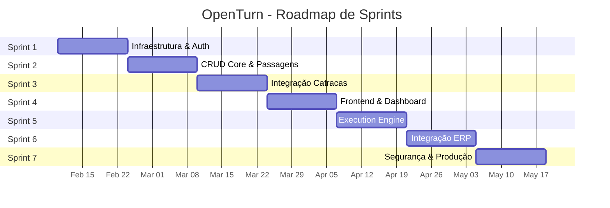
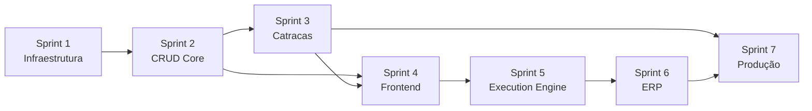

# Plano de Sprints - OpenTurn

> Middleware de controle de acesso físico para instituições educacionais.
> Conecta ERPs Educacionais a Catracas/Dispositivos de Controle de Acesso.

---

## Visão Geral do Produto

**OpenTurn** é um middleware multi-tenant que faz a ponte entre sistemas ERP educacionais (Gennera, Perseus, Lyceum, Mentor, Sponte, Sophia) e dispositivos de controle de acesso físico (Catracas ControlId iDNext/iDBlock). O sistema gerencia pessoas, matrículas, equipamentos, **registra todas as passagens (entradas/saídas) em catracas**, e oferece um **motor de execução de rotinas dinâmicas** (Schedule/Webhook) com código JavaScript editável via Monaco Editor.

### Personas

| Persona | Descrição | Necessidades Principais |
|---------|-----------|------------------------|
| **Super Root** | Administrador global do sistema | Criar clientes, instituições, visão total |
| **Admin do Cliente** | Gestor de um grupo educacional | Configurar instituições, ver relatórios consolidados |
| **Gestor da Instituição** | Diretor/Coordenador | Dashboard de passagens, gestão de pessoas, configurar catracas |
| **Operação** | Portaria/Recepção | Ver passagens em tempo real, cadastrar pessoas/tags |

### Critérios de Sucesso (MVP)

- [ ] Cadastro multi-tenant funcional (Cliente → Instituição → Pessoas)
- [ ] Integração com catraca ControlId (Push + Monitor)
- [ ] Registro de todas as passagens em catracas com dados completos
- [ ] Dashboard de monitoramento em tempo real
- [ ] Autenticação JWT com controle de acesso por grupo
- [ ] Motor de Rotinas Dinâmicas (Schedule + Webhook) com Monaco Editor

---

## Stack Tecnológico

| Camada | Tecnologia | Justificativa |
|--------|------------|---------------|
| **Frontend** | Next.js + TailAdmin | SSR, templates prontos para dashboard |
| **Backend** | NestJS v11+ | Modular, TypeScript nativo, decorators |
| **ORM** | Prisma | Type-safe, migrations, suporte PostgreSQL |
| **Banco** | PostgreSQL | RLS para multi-tenant, JSONB, performance |
| **Auth** | Passport + JWT | Standard da indústria para APIs REST |
| **Scheduler** | @nestjs/schedule + cron | CronJobs dinâmicos por instituição |
| **Sandbox** | vm2 / isolated-vm | Execução isolada de código JS |
| **Editor** | Monaco Editor | Editor de código no frontend |
| **Infra** | Docker + Docker Compose | Ambiente local reprodutível |

---

## Modelo de Dados Core — Tabela de Registros de Passagens

> [!IMPORTANT]
> A tabela `REGRegistroPassagem` é o **coração do sistema**. Todo giro de catraca (entrada ou saída) gera um registro nesta tabela.

```dbml
Table REGRegistroPassagem {
  REGCodigo            Int       [pk, increment]
  PESCodigo            Int       [ref: > PESPessoa.PESCodigo, note: 'Pessoa que passou']
  REGAcao              ENUM_ACAO_PASSAGEM [note: 'ENTRADA ou SAIDA']
  EQPCodigo            Int       [ref: > EQPEquipamento.EQPCodigo, note: 'Catraca onde ocorreu']
  REGTimestamp         BigInt    [note: 'Unix timestamp do momento da passagem (epoch)']
  REGDataHora          DateTime  [note: 'Data e hora da passagem (legível)']
  INSInstituicaoCodigo Int       [ref: > INSInstituicao.INSCodigo, note: 'Tenant - RLS']
  createdAt            DateTime  [default: `now()`]
}

enum ENUM_ACAO_PASSAGEM {
  ENTRADA
  SAIDA
}
```

**Campos:**
| Campo | Tipo | Descrição |
|-------|------|-----------|
| `REGCodigo` | Int (PK) | Identificador único do registro |
| `PESCodigo` | Int (FK) | Código da pessoa que passou na catraca |
| `REGAcao` | Enum | `ENTRADA` ou `SAIDA` |
| `EQPCodigo` | Int (FK) | Código do equipamento (catraca) |
| `REGTimestamp` | BigInt | Unix timestamp (epoch) do momento da passagem |
| `REGDataHora` | DateTime | Data e hora legível da passagem |
| `INSInstituicaoCodigo` | Int (FK) | Código da instituição (isolamento por RLS) |
| `createdAt` | DateTime | Quando o registro foi criado no banco |

---

## Sprints

### Sprint 1 — Fundação & Infraestrutura
**Duração:** 2 semanas
**Objetivo:** Ambiente de desenvolvimento funcional com banco de dados e autenticação básica.

| # | User Story | Prioridade | AC |
|---|-----------|------------|-----|
| 1.1 | Como desenvolvedor, quero um ambiente Docker local para rodar o sistema | MUST | Docker Compose sobe PostgreSQL + API sem erros |
| 1.2 | Como desenvolvedor, quero o schema Prisma com todas as tabelas base | MUST | Migrations rodam, tabelas criadas no banco |
| 1.3 | Como desenvolvedor, quero RLS configurado no PostgreSQL | MUST | Queries filtram por `INSInstituicaoCodigo` |
| 1.4 | Como Super Root, quero fazer login e receber um JWT | MUST | Login retorna token com `userId` e `roles` |
| 1.5 | Como desenvolvedor, quero seed de dados de teste | SHOULD | Script popula cliente, instituição, pessoas |

**Entregáveis:**
- [x] `docker-compose.yml` funcional
- [x] Schema Prisma com tabelas base
- [x] Policies RLS no PostgreSQL (`setup-rls.sql`)
- [x] Módulo de autenticação (JWT + bcrypt)
- [x] Script de seed (`prisma/seed.ts`)

---

### Sprint 2 — CRUD Core & Modelo de Dados Completo
**Duração:** 2 semanas
**Objetivo:** APIs de CRUD para todas as entidades centrais, incluindo a tabela de passagens.

| # | User Story | Prioridade | AC |
|---|-----------|------------|-----|
| 2.1 | Como Admin, quero cadastrar e gerenciar Clientes | MUST | CRUD completo via API REST |
| 2.2 | Como Admin, quero cadastrar e gerenciar Instituições | MUST | CRUD com vínculo a Cliente + RLS |
| 2.3 | Como Gestor, quero cadastrar e gerenciar Pessoas | MUST | CRUD com foto, tag, grupo + RLS |
| 2.4 | Como Gestor, quero cadastrar e gerenciar Matrículas | MUST | CRUD vinculado a Pessoa + RLS |
| 2.5 | Como Gestor, quero cadastrar e gerenciar Equipamentos | MUST | CRUD com IP, modelo + RLS |
| 2.6 | Como desenvolvedor, quero a tabela `REGRegistroPassagem` | MUST | Migration cria a tabela com todos os campos |
| 2.7 | Como Gestor, quero uma API de consulta de passagens | MUST | GET com filtros por data, pessoa, catraca |

**Entregáveis:**
- [x] Módulos NestJS: Cliente, Instituição, Pessoa, Matrícula, Equipamento
- [x] Módulo NestJS: RegistroPassagem (consulta com filtros + inserção)
- [x] Validação de DTOs com `class-validator`
- [x] Paginação padronizada (`PaginationDto` + `PaginatedResult`)

---

### Sprint 3 — Integração com Catracas ControlId
**Duração:** 2 semanas
**Objetivo:** Comunicação bidirecional com catracas ControlId (Push + Monitor).

| # | User Story | Prioridade | AC |
|---|-----------|------------|-----|
| 3.1 | Como sistema, quero receber comandos de Push da catraca | MUST | Endpoint `GET /push` retorna comandos pendentes |
| 3.2 | Como sistema, quero receber resultados de comandos | MUST | Endpoint `POST /result` processa retornos |
| 3.3 | Como sistema, quero receber eventos de passagem (Monitor) | MUST | Endpoint `POST /api/notifications/catra_event` registra passagem na tabela `REGRegistroPassagem` |
| 3.4 | Como sistema, quero autorizar acesso em tempo real (Online) | SHOULD | Endpoint `POST /new_user_identified.fcgi` valida e responde |
| 3.5 | Como Gestor, quero sincronizar pessoas com a catraca | MUST | Comando de sincronização envia usuários ao equipamento |

**Entregáveis:**
- [x] Módulo NestJS: ControlId Integration (`ControlidModule`)
- [x] Endpoints Push, Result, Monitor, Online
- [x] Serviço de enfileiramento de comandos (DB: `CMDComandoFila`)
- [x] Gravação automática de passagens na `REGRegistroPassagem`

---

### Sprint 4 — Frontend & Dashboard
**Duração:** 2 semanas
**Objetivo:** Interface web funcional com dashboard de monitoramento.

| # | User Story | Prioridade | AC |
|---|-----------|------------|-----|
| 4.1 | Como Gestor, quero um dashboard com resumo de passagens do dia | MUST | Cards de total entradas, saídas, presentes |
| 4.2 | Como Gestor, quero ver passagens em tempo real | MUST | Lista atualizada automaticamente |
| 4.3 | Como Operação, quero consultar o histórico de passagens de uma pessoa | MUST | Busca por nome/documento com filtro de período |
| 4.4 | Como Admin, quero navegar entre instituições | MUST | Seletor de instituição com contexto de tenant |
| 4.5 | Como Gestor, quero telas de CRUD para Pessoas e Equipamentos | SHOULD | Formulários de cadastro e listagem |

**Entregáveis:**
- [x] Layout base TailAdmin com navegação por tenant
- [x] Página de Dashboard com cards e gráficos
- [x] Página de Passagens (lista + filtros)
- [x] Páginas CRUD (Pessoas, Equipamentos)
- [x] Login e controle de acesso por grupo

---

### Sprint 5 — Motor de Rotinas Dinâmicas (Execution Engine)
**Duração:** 2 semanas
**Objetivo:** Motor de execução de rotinas JavaScript por instituição (Schedule + Webhook).

| # | User Story | Prioridade | AC |
|---|-----------|------------|-----|
| 5.1 | Como desenvolvedor, quero as tabelas `ROTRotina` e `ROTExecucaoLog` | MUST | Migration cria as tabelas com todos os campos e enums |
| 5.2 | Como Gestor, quero um CRUD de rotinas com editor Monaco | MUST | Tela no frontend com Monaco Editor para escrever código JS, salvar e ativar/desativar rotinas |
| 5.3 | Como Gestor, quero criar rotinas do tipo Schedule (CronJob) | MUST | Definir expressão cron, código JS é executado automaticamente no horário definido |
| 5.4 | Como Gestor, quero criar rotinas do tipo Webhook | MUST | Definir path, método HTTP (GET/POST/PUT/PATCH), código JS recebe body, params e path da requisição |
| 5.5 | Como sistema, quero executar código JS em sandbox isolada | MUST | VM isolada (vm2/isolated-vm) com timeout configurável, sem acesso ao filesystem |
| 5.6 | Como sistema, quero logar todas as execuções | MUST | `ROTExecucaoLog` registra status, duração, resultado, erro e trigger |
| 5.7 | Como Gestor, quero ver o histórico de execuções de cada rotina | SHOULD | Listagem com filtros por status, data, rotina |
| 5.8 | Como sistema, quero injetar contexto seguro nas rotinas | MUST | `context.adapters`, `context.instituicao`, `context.request`, `context.db`, `fetch` |

**Entregáveis:**
- [ ] Módulo NestJS: Rotina (CRUD + Monaco Editor frontend)
- [ ] Execution Engine com sandbox (vm2/isolated-vm)
- [ ] CronScheduler dinâmico (`@nestjs/schedule`)
- [ ] WebhookRouter dinâmico (path: `/instituicao/:cod/webhook/:path`)
- [ ] Logging de execuções com `ROTExecucaoLog`
- [ ] Tela de histórico de execuções

---

### Sprint 6 — Integração ERP & Sincronização
**Duração:** 2 semanas
**Objetivo:** Integração com o primeiro ERP (Gennera) usando padrão Strategy + Rotinas do Engine.

| # | User Story | Prioridade | AC |
|---|-----------|------------|-----|
| 6.1 | Como desenvolvedor, quero a interface `IErpAdapter` | MUST | Interface TypeScript definida |
| 6.2 | Como Gestor, quero configurar credenciais do ERP | MUST | CRUD de `ERPConfiguracao` |
| 6.3 | Como sistema, quero sincronizar alunos do Gennera | MUST | Adapter Gennera importa/atualiza pessoas |
| 6.4 | Como sistema, quero sincronizar turmas/matrículas do Gennera | SHOULD | Adapter importa cursos, séries, turmas |
| 6.5 | Como Gestor, quero ver o status da última sincronização | SHOULD | Log de sync com sucesso/erro por registro |
| 6.6 | Como Gestor, quero criar rotinas de sincronização via Engine | SHOULD | Rotina Schedule pré-configurada que usa o adapter do ERP |

**Entregáveis:**
- [ ] Interface `IErpAdapter` + Factory Pattern
- [ ] `GenneraAdapter` implementado
- [ ] Serviço de sincronização com logs
- [ ] Tela de configuração ERP no frontend
- [ ] Rotinas de exemplo usando o Execution Engine

---

### Sprint 7 — Polish, Segurança & Produção
**Duração:** 2 semanas
**Objetivo:** Hardening de segurança, testes, e preparação para deploy em produção.

| # | User Story | Prioridade | AC |
|---|-----------|------------|-----|
| 7.1 | Como desenvolvedor, quero testes unitários nos módulos core | MUST | Cobertura ≥ 80% nos services |
| 7.2 | Como desenvolvedor, quero testes E2E nos fluxos críticos | MUST | Login, CRUD, registro de passagem, execução de rotina |
| 7.3 | Como Admin, quero auditoria de ações | SHOULD | Log de quem fez o quê e quando |
| 7.4 | Como sistema, quero rate limiting nas APIs e webhooks | MUST | Proteção contra abuso (inclui limite de execuções por instituição) |
| 7.5 | Como sistema, quero CI/CD configurado | SHOULD | Pipeline de build, test, deploy |
| 7.6 | Como sistema, quero monitoramento de saúde | SHOULD | Health checks e métricas básicas |

**Entregáveis:**
- [ ] Suíte de testes unitários e E2E
- [ ] Rate limiting e helmet configurados
- [ ] Pipeline CI/CD (GitHub Actions)
- [ ] Dockerfile de produção otimizado
- [ ] Documentação de deploy

---

## Roadmap Visual



---

## Dependências entre Sprints



> [!NOTE]
> Sprint 5 (Execution Engine) depende do Frontend (Sprint 4) para o Monaco Editor. Sprint 6 (ERP) aproveita o Engine para criar rotinas de sincronização. Sprint 7 é o fechamento geral.

---

## Progresso Atual

| Sprint | Status | Progresso |
|--------|--------|-----------|
| Sprint 1 | ✅ Concluído | Docker ✅ Schema ✅ RLS ✅ Auth ✅ Seed ✅ |
| Sprint 2 | ✅ Concluído | Módulos ✅ Passagens ✅ DTOs ✅ Paginação ✅ |
| Sprint 3 | ✅ Concluído | ControlId ✅ Push ✅ Monitor ✅ Online ✅ Sync ✅ |
| Sprint 4 | ✅ Concluído | Dashboard ✅ Passagens ✅ CRUDs ✅ Auth ✅ Tenant ✅ |
| Sprint 5 | ⬜ Não iniciado | — |
| Sprint 6 | ⬜ Não iniciado | — |
| Sprint 7 | ⬜ Não iniciado | — |
