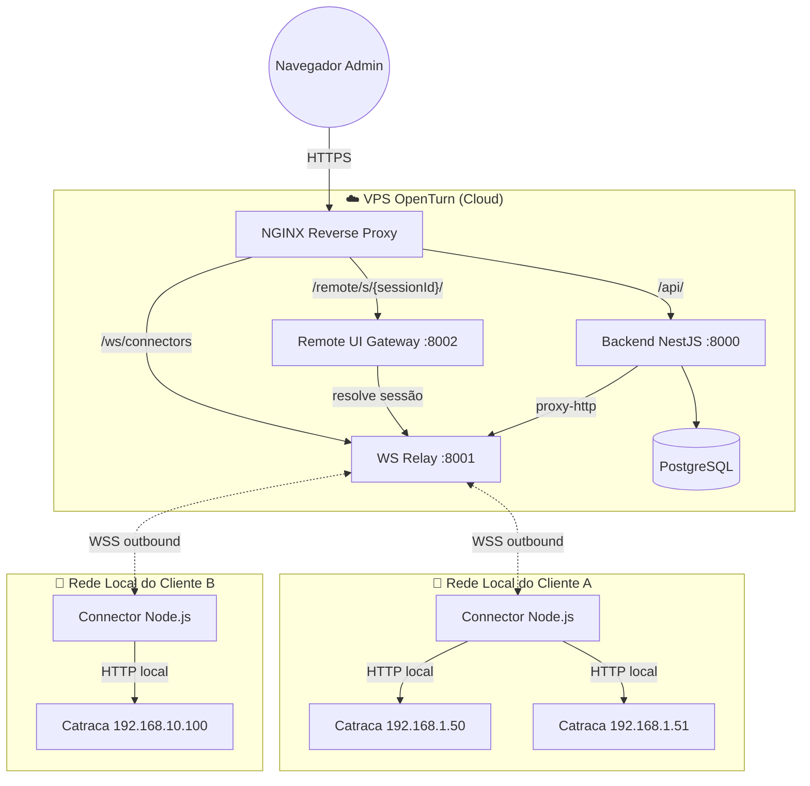
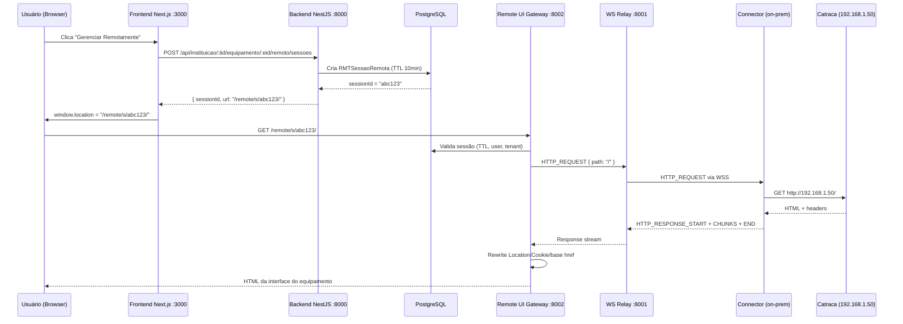

# Addon On-Premise Connector — Arquitetura Técnica

> Ponte segura entre o OpenTurn SaaS e equipamentos ControlID em redes sem IP público.

---

## 1. Problema

| Cenário | Situação Atual | Necessidade |
|---------|---------------|-------------|
| Cliente com IP público | Port-forwarding direto → OpenTurn acessa `http://IP:porta` | ✅ Funciona |
| Cliente **sem** IP público | Sem acesso ao equipamento pela internet | ❌ **Bloqueado** |
| Múltiplos clientes com mesma faixa IP (192.168.1.x) | Conflito de endereçamento interno | ❌ Precisa de isolamento |

**Requisitos do Addon:**
1. **API Proxy** — rotear chamadas HTTP do SaaS para APIs locais do equipamento
2. **UI Remota** — acessar a interface web (HTML/CSS/JS) do equipamento como se fosse local
3. **Zero port-forwarding** — o Connector inicia a conexão outbound (WSS), sem portas expostas

---

## 2. Visão Geral da Arquitetura



---

## 3. Componentes

### 3.1 Connector (Addon On-Premise — Node.js)

Aplicação Node.js instalada em máquina/servidor na **rede local** do cliente.

| Aspecto | Detalhe |
|---------|---------|
| **Runtime** | Node.js 20+ |
| **Conexão** | WSS outbound → `wss://dominio.com/ws/connectors` |
| **Autenticação** | JWT do Connector (emitido no pareamento) |
| **Função** | Executa requisições HTTP locais (undici) e devolve resposta via WS |
| **Portas expostas** | Nenhuma (opcional: `localhost:22100/health` para diagnóstico) |
| **Instalação** | npm global, pm2 ou systemd |

**Fluxo do Connector:**
```
1. Lê config local (~/.openturn-connector/config.json)
2. Conecta WSS com JWT
3. Recebe HTTP_REQUEST do Relay
4. Faz HTTP local → http://IP_EQUIPAMENTO/...
5. Responde HTTP_RESPONSE_START + HTTP_RESPONSE_CHUNK + HTTP_RESPONSE_END
6. Loop
```

### 3.2 WS Relay (Cloud — NestJS Gateway)

Gateway WebSocket no VPS que mantém conexões persistentes com Connectors.

| Aspecto | Detalhe |
|---------|---------|
| **Porta** | 8001 (atrás do NGINX) |
| **Rota WS** | `wss://dominio.com/ws/connectors` |
| **Autenticação** | Valida JWT do Connector no handshake |
| **Mapa** | `connectorId → WebSocket` |
| **Função** | Correlaciona `requestId` ↔ response, timeouts |

### 3.3 Remote UI Gateway (Cloud — Express/Fastify)

Reverse-proxy L7 que espelha a UI web do equipamento.

| Aspecto | Detalhe |
|---------|---------|
| **Porta** | 8002 (atrás do NGINX) |
| **Rota** | `ANY /remote/s/:sessionId/*` |
| **Função** | Valida sessão → envia HTTP_REQUEST via Relay → streama resposta ao browser |

**Rewrites essenciais:**
| Header/Elemento | Rewrite |
|-----------------|---------|
| `Location` (redirect) | `/login` → `/remote/s/{sessionId}/login` |
| `Set-Cookie Path` | `Path=/` → `Path=/remote/s/{sessionId}/` |
| HTML `<head>` | Injeta `<base href="/remote/s/{sessionId}/">` |

> [!IMPORTANT]
> Sem iframe. A UI do equipamento é servida como **top-level page** no path `/remote/s/{sessionId}/...`, evitando problemas com scripts, cookies e CSP.

### 3.4 Backend API (extensão do NestJS existente)

Novos endpoints no backend OpenTurn — todos sob o tenant `/instituicao/:codigoInstituicao/`:

| Endpoint | Método | Função |
|----------|--------|--------|
| `/api/instituicao/:tid/equipamento/:eid/proxy-http` | POST | Proxy genérico API do equipamento |
| `/api/instituicao/:tid/equipamento/:eid/remoto/sessoes` | POST | Cria sessão de UI remota |
| `/api/instituicao/:tid/equipamento/:eid/remoto/sessoes/:sid` | DELETE | Encerra sessão |
| `/api/instituicao/:tid/connector/pair` | POST | Registra novo Connector para a instituição |
| `/api/instituicao/:tid/connector/token` | POST | Renova JWT do Connector |
| `/api/instituicao/:tid/connector/status` | GET | Status de conexão do Connector |

> [!NOTE]
> A gestão do Connector (pareamento, token, status) é feita **por instituição**, na mesma página de configurações da instituição (`settings/institutions/[id]`). Não existe rota global de connectors — tudo é tenant-scoped.

---

## 4. Protocolo WebSocket (Relay ↔ Connector)

### 4.1 Handshake
```
Connector → WSS → wss://dominio.com/ws/connectors
Headers:
  Authorization: Bearer <connectorJwt>
```

### 4.2 Mensagens

#### `HTTP_REQUEST` (Cloud → Connector)
```json
{
  "type": "HTTP_REQUEST",
  "requestId": "r-9f1a",
  "tenantId": 2,
  "equipId": 100,
  "target": {
    "baseUrl": "http://192.168.1.50",
    "method": "GET",
    "path": "/",
    "headers": { "Accept": "text/html" },
    "body": null
  },
  "timeoutMs": 60000
}
```

#### `HTTP_RESPONSE_START` (Connector → Cloud)
```json
{
  "type": "HTTP_RESPONSE_START",
  "requestId": "r-9f1a",
  "statusCode": 200,
  "headers": { "content-type": "text/html", "set-cookie": "session=abc" }
}
```

#### `HTTP_RESPONSE_CHUNK` (Connector → Cloud)
```json
{
  "type": "HTTP_RESPONSE_CHUNK",
  "requestId": "r-9f1a",
  "data": "<base64-encoded-chunk>",
  "index": 0
}
```

#### `HTTP_RESPONSE_END` (Connector → Cloud)
```json
{
  "type": "HTTP_RESPONSE_END",
  "requestId": "r-9f1a"
}
```

#### `PING` / `PONG` (heartbeat bidirecional)
```json
{ "type": "PING", "ts": 1739823120000 }
{ "type": "PONG", "ts": 1739823120000 }
```

---

## 5. Modelo de Dados (Extensões ao Prisma Schema)

### Extensão ao `EQPEquipamento`

Novo campo booleano `EQPUsaAddon`:

```prisma
model EQPEquipamento {
  // ... campos existentes ...
  EQPUsaAddon          Boolean               @default(false) // Se true, acesso via Connector
}
```

Novo campo no `EQPConfig` JSON (quando `EQPUsaAddon = true`):
```json
{
  "login": "admin",
  "password": "admin",
  "modo": "STANDALONE",
  "localBaseUrl": "http://192.168.1.50"
}
```

> [!NOTE]
> `EQPUsaAddon = false` → acesso direto ao IP do equipamento (IP público, port-forwarding).
> `EQPUsaAddon = true` → acesso via Connector da instituição (WS Relay).

### Novas tabelas

```dbml
Table CONConnector {
  CONCodigo         Int       [pk, increment]
  CONNome           String    [not null, note: 'Nome descritivo (ex: "Servidor Portaria")']
  CONToken          String    [unique, note: 'JWT para autenticação WSS']
  CONStatus         ENUM_CONNECTOR_STATUS [default: 'OFFLINE']
  CONUltimoHeartbeat DateTime?
  CONVersao         String?   [note: 'Versão do addon instalado']
  CONMetadata       Json?     [note: 'SO, hostname, IP externo']
  CLICodigo         Int       [ref: > CLICliente.CLICodigo]
  INSInstituicaoCodigo Int    [unique, ref: > INSInstituicao.INSCodigo, note: '1:1 — cada instituição tem no máximo 1 Connector']
  createdAt         DateTime  [default: `now()`]
  updatedAt         DateTime  [default: `now()`]
}

Note: Relação 1:1 — cada instituição pode ter NO MÁXIMO 1 Connector pareado.

enum ENUM_CONNECTOR_STATUS {
  ONLINE
  OFFLINE
  PAIRING
}

Table RMTSessaoRemota {
  RMTCodigo         Int       [pk, increment]
  RMTSessionId      String    [unique, note: 'UUID da sessão']
  EQPCodigo         Int       [ref: > EQPEquipamento.EQPCodigo]
  CONCodigo         Int       [ref: > CONConnector.CONCodigo]
  USRCodigo         Int       [ref: > USRUsuario.USRCodigo]
  RMTStatus         ENUM_SESSAO_STATUS [default: 'ATIVA']
  RMTExpiraEm       DateTime  [not null]
  INSInstituicaoCodigo Int    [ref: > INSInstituicao.INSCodigo]
  createdAt         DateTime  [default: `now()`]
  updatedAt         DateTime  [default: `now()`]
}

enum ENUM_SESSAO_STATUS {
  ATIVA
  EXPIRADA
  ENCERRADA
}
```

---

## 6. Rotas (Consolidação)

### Frontend
| Rota | Descrição |
|------|-----------|
| `/instituicao/:tid/equipamentos/:eid` | Detalhe do equipamento |
| `/instituicao/:tid/equipamentos/:eid/configuracao` | Configuração do equipamento (botão "Gerenciar Remotamente" no header, alinhado à direita) |
| `/instituicao/:tid/equipamentos/:eid/api` | Ferramentas de API |
| `settings/institutions/:tid` | Configurações da Inst. (pareamento, token e status do Connector) |

### Backend API (todos sob tenant)
| Rota | Método | Descrição |
|------|--------|-----------|
| `/api/instituicao/:tid/equipamento/:eid/proxy-http` | POST | Proxy HTTP genérico |
| `/api/instituicao/:tid/equipamento/:eid/remoto/sessoes` | POST | Criar sessão |
| `/api/instituicao/:tid/equipamento/:eid/remoto/sessoes/:sid` | DELETE | Encerrar sessão |
| `/api/instituicao/:tid/connector/pair` | POST | Pareamento do Connector |
| `/api/instituicao/:tid/connector/token` | POST | Renovar token |
| `/api/instituicao/:tid/connector/status` | GET | Status do Connector |

### Remote UI Gateway
| Rota | Método | Descrição |
|------|--------|-----------|
| `/remote/s/:sessionId/*` | ANY | Proxy L7 da UI do equipamento |

### WebSocket
| Rota | Descrição |
|------|-----------|
| `/ws/connectors` | Conexão persistente dos Connectors |

---

## 7. Frontend — Localização dos Controles

Os controles do Addon ficam em **duas páginas diferentes**:

### 7.1 Configurações da Instituição (`settings/institutions/[id]/page.tsx`)

Gestão do Connector (pareamento, token, status) como `ComponentCard`:

```
Configurações: Instituição X
├── Hardware Monitor (ControlID)    ← já existe
├── Connector On-Premise (Addon)    ← NOVO
│   ├── Status: 🟢 Online / 🔴 Offline
│   ├── Nome: "Servidor Portaria"
│   ├── Versão: v1.0.0
│   ├── Último Heartbeat: há 15s
│   ├── [Gerar Código de Pareamento]
│   ├── [Renovar Token]
│   └── [Desparear]
├── Configuração do ERP Educacional  ← já existe
└── Retenção de Logs                 ← já existe
```

### 7.2 Configuração do Equipamento (`instituicao/[tid]/equipamentos/[eid]/configuracao/page.tsx`)

Botão **"Gerenciar Remotamente"** no **header da página**, alinhado à direita, na mesma linha do nome do equipamento:

```
┌─────────────────────────────────────────────────────────────────┐
│ [←]  Configuração: Catraca Entrada Principal    [🖥 Gerenciar  │
│      ControlID - iDBlock (192.168.1.50)          Remotamente] │
└─────────────────────────────────────────────────────────────────┘
│  Geral  │  Horários  │  Departamentos  │
```

> [!NOTE]
> O botão "Gerenciar Remotamente" só aparece quando `EQPUsaAddon = true` e o Connector da instituição está `ONLINE`.

---

## 8. Segurança

| Camada | Mecanismo |
|--------|-----------|
| **Connector Auth** | JWT assinado com RS256, scoped por `clienteId + instituicaoId` |
| **Sessão Remota** | TTL (10 min default), validação de `userId + tenantId` |
| **Cookie Isolation** | `Set-Cookie Path` reescrito para `/remote/s/{sessionId}/` |
| **Rate Limit** | Por sessão e por Connector |
| **Auditoria** | Registro de toda sessão remota: quem, quando, qual equipamento |
| **WS Heartbeat** | PING/PONG a cada 30s, desconecta após 90s sem resposta |

---

## 9. Fluxo: Gerenciar Equipamento Remotamente



---

## 10. Ambiente de Desenvolvimento

Como o ambiente de dev está na mesma rede que o equipamento:

```
Backend API:  http://localhost:8000
WS Relay:     ws://localhost:8001/ws/connectors
Remote GW:    http://localhost:8002/remote/...
Frontend:     http://localhost:3000
Connector:    Roda local, aponta para ws://localhost:8001
Equipamento:  http://192.168.1.50 (mesma rede)
```

> [!TIP]
> Para simular um equipamento sem hardware real, suba um servidor HTTP simples (`npx http-server -p 9000`) servindo HTML estático e configure `localBaseUrl=http://localhost:9000` no equipamento de teste.
