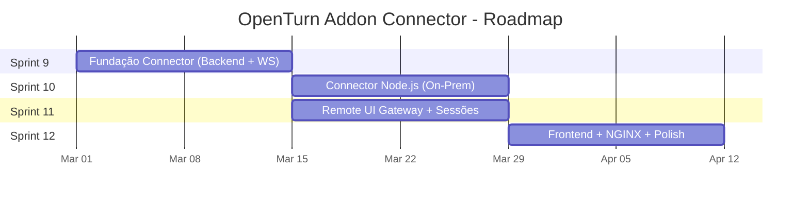
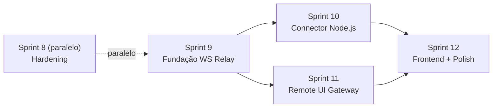

# Addon On-Premise Connector — Plano de Implementação (Sprints)

> Planejamento detalhado para implementação do sistema Connector/Remote UI Gateway no OpenTurn.

---

## Visão Geral

O Addon On-Premise Connector resolve o problema de clientes sem IP público que precisam operar equipamentos ControlID em modo Standalone/Offline. O sistema é composto por:

1. **Connector** — App Node.js instalado na rede do cliente (outbound WSS)
2. **WS Relay** — Gateway WebSocket no VPS (gerencia conexões dos Connectors)
3. **Remote UI Gateway** — Reverse-proxy L7 que espelha a UI do equipamento
4. **Backend Extensions** — Novos endpoints sob `/api/instituicao/:tid/...`
5. **Frontend Extensions** — Gestão do Connector nas configurações da inst. + botão "Gerenciar Remotamente"

---

## Pré-requisitos

- Sprint 1-7 concluídas ✅
- Sprint 8 (hardening) roda em paralelo com Sprint 9
- **Sprint 9 é a próxima sprint a iniciar** (não espera Sprint 8 finalizar)
- Equipamento ControlID acessível na rede de desenvolvimento
- **Portas atuais**: webapi `:8000`, webapp `:3000`
- **Relação 1:1**: 1 Connector por instituição, 1 instituição por Connector

---

## Sprint 9 — Fundação Connector (Backend + WS Relay)

**Duração:** 2 semanas  
**Objetivo:** Infraestrutura de pareamento, conexão WebSocket e proxy HTTP básico.

### User Stories

| # | User Story | Prioridade | AC |
|---|-----------|------------|-----|
| 9.1 | Como desenvolvedor, quero as tabelas `CONConnector` e `RMTSessaoRemota` no Prisma, e o campo `EQPUsaAddon` (boolean) na tabela de equipamentos | MUST | Migration roda, tabelas criadas, campo boolean funcional |
| 9.2 | Como Admin, quero parear um Connector via configurações da instituição | MUST | POST `/api/instituicao/:tid/connector/pair` retorna JWT |
| 9.3 | Como sistema, quero que o Connector se conecte via WSS ao Relay | MUST | Conexão WSS estabelecida com JWT válido |
| 9.4 | Como sistema, quero um heartbeat PING/PONG entre Relay e Connector | MUST | Status ONLINE/OFFLINE atualizado a cada 30s |
| 9.5 | Como sistema, quero enviar HTTP_REQUEST e receber HTTP_RESPONSE via WS | MUST | Chamada local executada e resposta retornada |
| 9.6 | Como Gestor, quero um endpoint proxy-http para chamar APIs do equipamento | MUST | POST `/api/instituicao/:tid/equipamento/:eid/proxy-http` retorna resposta |
| 9.7 | Como Admin, quero renovar o token e ver status do Connector na configuração da instituição | MUST | POST `.../connector/token` e GET `.../connector/status` funcionam |

### Entregáveis

- [ ] Migration Prisma: `CONConnector` + `RMTSessaoRemota` + `EQPUsaAddon`
- [ ] Módulo NestJS: `ConnectorModule` (CRUD + pairing + token + status) sob `/api/instituicao/:tid/connector/`
- [ ] NestJS Gateway: `WsRelayGateway` (porta 8001, mapa de conexões)
- [ ] Protocolo WS: HTTP_REQUEST/RESPONSE com chunking
- [ ] Heartbeat PING/PONG com auto-disconnect
- [ ] Endpoint `proxy-http` no `EquipamentoController`

### Tarefas Técnicas

| Task | Agent | Dependência |
|------|-------|-------------|
| 9.1.1 Criar migration Prisma (`CONConnector`, `RMTSessaoRemota`, `EQPUsaAddon`) | `database-architect` | — |
| 9.1.2 Criar `ConnectorModule` (service + controller) sob rota tenant | `backend-specialist` | 9.1.1 |
| 9.1.3 Criar `WsRelayGateway` (@nestjs/websockets) na porta 8001 | `backend-specialist` | 9.1.1 |
| 9.1.4 Implementar protocolo WS (tipos + serialização) | `backend-specialist` | 9.1.3 |
| 9.1.5 Implementar heartbeat + status tracking | `backend-specialist` | 9.1.3 |
| 9.1.6 Criar endpoint `proxy-http` no `EquipamentoController` | `backend-specialist` | 9.1.4 |
| 9.1.7 Testes unitários do protocolo WS | `backend-specialist` | 9.1.4 |

---

## Sprint 10 — Connector Node.js (Addon On-Premise)

**Duração:** 2 semanas  
**Objetivo:** Aplicação Node.js instalável que conecta ao Relay e executa requisições locais.

### User Stories

| # | User Story | Prioridade | AC |
|---|-----------|------------|-----|
| 10.1 | Como técnico, quero instalar o Connector via `npm install -g @openturn/connector` | MUST | Pacote npm funcional |
| 10.2 | Como técnico, quero parear o Connector com um comando interativo | MUST | `openturn-connector pair` abre wizard |
| 10.3 | Como Connector, quero conectar automaticamente ao Relay no boot | MUST | Reconnect com backoff exponencial |
| 10.4 | Como Connector, quero executar requisições HTTP locais com undici | MUST | Request local → resposta chunked via WS |
| 10.5 | Como técnico, quero verificar saúde via `localhost:22100/health` | SHOULD | Endpoint retorna status + versão |
| 10.6 | Como técnico, quero logs estruturados para diagnóstico | SHOULD | Logs em console e arquivo rotativo |

### Entregáveis

- [ ] Projeto `packages/connector/` (standalone Node.js CLI)
- [ ] CLI commands: `pair`, `start`, `status`, `version`
- [ ] Conexão WSS com auto-reconnect (backoff exponencial)
- [ ] Executor HTTP local (undici, streaming, chunked response)
- [ ] Arquivo de configuração `~/.openturn-connector/config.json`
- [ ] Health endpoint `localhost:22100/health`
- [ ] Logger (pino) com rotação de arquivos

### Tarefas Técnicas

| Task | Agent | Dependência |
|------|-------|-------------|
| 10.1.1 Setup projeto Node.js (TypeScript, tsup build) | `backend-specialist` | — |
| 10.1.2 Implementar CLI (`commander.js`) | `backend-specialist` | 10.1.1 |
| 10.1.3 Implementar WSS client com reconnect | `backend-specialist` | 10.1.1 |
| 10.1.4 Implementar executor HTTP local (undici) | `backend-specialist` | 10.1.3 |
| 10.1.5 Implementar pairing flow (gera config) | `backend-specialist` | 10.1.2 |
| 10.1.6 Health endpoint (fastify mini) | `backend-specialist` | 10.1.1 |
| 10.1.7 Testes do executor HTTP e protocolo WS | `backend-specialist` | 10.1.4 |

---

## Sprint 11 — Remote UI Gateway + Sessões

**Duração:** 2 semanas  
**Objetivo:** Espelhar a interface web do equipamento no browser do usuário, sem iframe.

### User Stories

| # | User Story | Prioridade | AC |
|---|-----------|------------|-----|
| 11.1 | Como Gestor, quero criar uma sessão de UI remota para um equipamento (que tenha `EQPUsaAddon = true`) | MUST | POST cria sessão com TTL de 10 min |
| 11.2 | Como sistema, quero servir a UI do equipamento em `/remote/s/{sessionId}/` | MUST | HTML renderiza corretamente no browser |
| 11.3 | Como sistema, quero reescrever Location headers nos redirects | MUST | Redirect mantém prefixo `/remote/s/{sessionId}/` |
| 11.4 | Como sistema, quero reescrever Set-Cookie Path | MUST | Cookies não vazam fora do path da sessão |
| 11.5 | Como sistema, quero injetar `<base href>` no HTML | MUST | Recursos relativos (CSS/JS/img) funcionam |
| 11.6 | Como sistema, quero validar TTL e permissões da sessão | MUST | 403 se sessão expirada ou usuário sem permissão |
| 11.7 | Como Gestor, quero uma toolbar injetada com "Voltar" e "Encerrar sessão" | SHOULD | Barra fixa no topo da UI espelhada |

### Entregáveis

- [ ] Servidor Express/Fastify: Remote UI Gateway (porta 8002)
- [ ] Rota `ANY /remote/s/:sessionId/*` com proxy completo
- [ ] Rewrite engine: Location, Set-Cookie, `<base href>`
- [ ] Validação de sessão (TTL, userId, tenantId)
- [ ] Toolbar injetada no HTML (botão Voltar + Encerrar)
- [ ] Endpoint DELETE para encerrar sessão
- [ ] Testes de integração (rewrites, cookies, redirects)

### Tarefas Técnicas

| Task | Agent | Dependência |
|------|-------|-------------|
| 11.1.1 Criar servidor Express standalone (porta 8002) | `backend-specialist` | Sprint 9 |
| 11.1.2 Implementar validação de sessão (DB lookup) | `backend-specialist` | 11.1.1 |
| 11.1.3 Implementar proxy handler (WS Relay integration) | `backend-specialist` | 11.1.1 |
| 11.1.4 Implementar rewrite engine (Location, Cookie, base) | `backend-specialist` | 11.1.3 |
| 11.1.5 Implementar toolbar injection (HTML transform) | `frontend-specialist` | 11.1.4 |
| 11.1.6 Testes de integração e2e com mock equipment | `backend-specialist` | 11.1.4 |

---

## Sprint 12 — Frontend + NGINX + Polish

**Duração:** 2 semanas  
**Objetivo:** Interface de gestão, configuração NGINX e polimento final.

### User Stories

| # | User Story | Prioridade | AC |
|---|-----------|------------|-----|
| 12.1 | Como Admin, quero uma seção "Connector On-Premise" nas configurações da instituição | MUST | ComponentCard com status, versão, heartbeat, pareamento |
| 12.2 | Como Gestor, quero um botão "Gerenciar Remotamente" no header da página de configuração do equipamento (alinhado à direita, mesmo nível do nome), visível apenas se `EQPUsaAddon = true` | MUST | Clica → cria sessão → redireciona para `/remote/s/{sessionId}/` |
| 12.3 | Como Admin, quero gerar código de pareamento na configuração da instituição | MUST | Exibe comando + token temporário |
| 12.4 | Como desenvolvedor, quero a configuração NGINX completa | MUST | Dev e Produção documentados |
| 12.5 | Como Gestor, quero ver indicador de Connector online/offline na configuração da instituição | SHOULD | Badge verde/vermelho |
| 12.6 | Como Admin, quero desparear um Connector | SHOULD | Ação na seção de Connector nas configurações |
| 12.7 | Como Gestor, quero timeouts diferenciados (UI: 60s, API: 15s) | SHOULD | Configurable no proxy-http e gateway |
| 12.8 | Como Gestor, quero um campo boolean "Usa Addon" no cadastro de equipamento | MUST | Toggle no form de equipamento |

### Entregáveis

- [ ] Seção "Connector On-Premise" na página `settings/institutions/[id]/page.tsx`
- [ ] Botão "Gerenciar Remotamente" no header da página `configuracao/page.tsx` do equipamento (alinhado à direita, condicional `EQPUsaAddon`)
- [ ] Toggle "Usa Addon" no formulário de cadastro de equipamento
- [ ] Badge de status do Connector (online/offline) nas configurações
- [ ] Config NGINX: dev (HTTP) e prod (HTTPS + WSS)
- [ ] Rate limiting e timeouts diferenciados
- [ ] Auditoria de sessões remotas (quem, quando, equipamento)

### Tarefas Técnicas

| Task | Agent | Dependência |
|------|-------|-------------|
| 12.1.1 Criar seção Connector na página de configurações da instituição | `frontend-specialist` | Sprint 9 |
| 12.1.2 Criar componente PairModal para gerar código | `frontend-specialist` | 12.1.1 |
| 12.1.3 Adicionar botão "Gerenciar Remotamente" no header da `configuracao/page.tsx` (right-aligned) | `frontend-specialist` | Sprint 11 |
| 12.1.4 Adicionar toggle "Usa Addon" no form de equipamento | `frontend-specialist` | 9.1.1 |
| 12.1.5 Configuração NGINX (dev + prod) | `backend-specialist` | Sprint 11 |
| 12.1.6 Rate limiting + auditoria | `backend-specialist` | 12.1.5 |
| 12.1.7 Testes E2E (pair → connect → remote UI) | `backend-specialist` | All |

---

## Roadmap Visual do Addon

> [!NOTE]
> Sprint 10 e Sprint 11 podem rodar **em paralelo** (backend Relay já está pronto na Sprint 9).

---

## Dependências entre Sprints

> [!IMPORTANT]
> Sprint 9 **NÃO** depende da finalização da Sprint 8. Ambas rodam em paralelo.

---

## Verificação Final

### Criterios de Aceite Globais

- [ ] Connector pareia e conecta via WSS sem port-forwarding
- [ ] `proxy-http` executa chamada na catraca via Connector (somente se `EQPUsaAddon = true`)
- [ ] UI remota renderiza interface do equipamento sem iframe
- [ ] Múltiplos clientes com mesma faixa IP (192.168.1.x) funcionam isoladamente
- [ ] Sessão expira após TTL e nega acesso
- [ ] NGINX roteando corretamente: `/api/`, `/ws/`, `/remote/`
- [ ] Heartbeat mantém status online/offline atualizado
- [ ] Gestão do Connector funciona na página de configurações da instituição

### Testes Recomendados

| Tipo | Descrição | Comando/Método |
|------|-----------|----------------|
| **Unit** | Protocolo WS (serialização, chunking) | `npm test -- --grep "ws-protocol"` |
| **Unit** | Rewrite engine (Location, Cookie, base) | `npm test -- --grep "rewrite"` |
| **Integration** | Proxy-http end-to-end | Mock equipment + proxy-http call |
| **Integration** | Remote UI session lifecycle | Create → use → expire → deny |
| **E2E** | Fluxo completo: pair → connect → remote UI | Manual com equipamento real |
| **Manual** | NGINX routing validation | curl commands against all routes |
