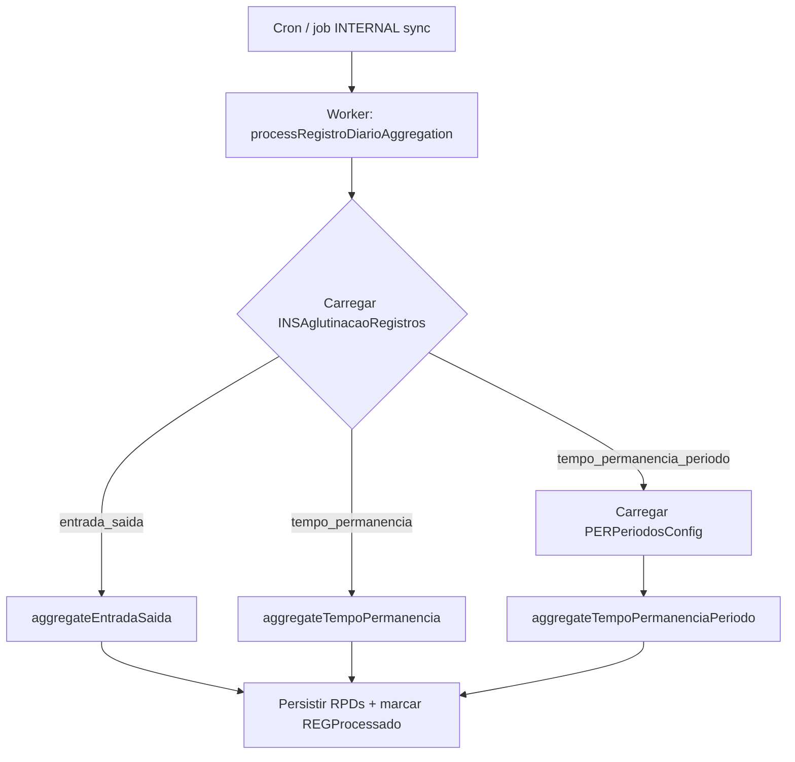

# Feature: Configuração de tipo de aglutinação de registros diários

**Versão:** 0.4 (spec fechada — PO 2026-05-22, + Fase 8 sync ERP)  
**Data:** 2026-05-22  
**Escopo:** `webapi`, `webapp`, `worker`

---

## 1. Objetivo

Permitir que cada instituição configure **como passagens brutas** (`REGRegistroPassagem`) são agregadas em **registros diários** (`RPDRegistrosDiarios`), com três modos:

| Modo | Chave | Resultado por pessoa/dia |
|------|-------|--------------------------|
| Tempo de permanência | `tempo_permanencia` | Várias janelas entrada→saída (ciclos de presença) |
| Tempo de permanência por período | `tempo_permanencia_periodo` | Uma janela por período cadastrado (min entrada / max saída dentro do range) |
| Entrada e saída do dia | `entrada_saida` | Uma única janela (menor entrada / maior saída do dia) — **comportamento atual** |

A configuração de aglutinação é exposta na tela de settings da instituição, logo abaixo dos blocos **Sincronização de Registros Diários** e **Sincronização de Frequências ao ERP**, e consumida pelo worker em `processRegistroDiarioAggregation`.

---

## 2. Contexto atual no código

| Área | Situação hoje |
|------|----------------|
| Agendamento sync passagens → RPD | `INSTempoSync` + `INSSyncRegistrosDiarios` em `INSInstituicao` |
| Agendamento sync RPD → ERP | `INSTempoFreqEducacional` + `INSSyncFreqEducacional` — ver [sync-freq-educacional.md](./sync-freq-educacional.md) |
| Agregação worker | `buildPassagemDayGroups` → min ENTRADA + max SAIDA por (pessoa, dia UTC) |
| Persistência RPD | `@@unique([INSInstituicaoCodigo, PESCodigo, RPDData])` — **apenas 1 linha por pessoa/dia** |
| ERP Gennera | `GenneraAttendanceService` assume 1 RPD/pessoa/dia ao lançar intervalos |

---

## 3. Decisões confirmadas (PO — 2026-05-22)

| Tópico | Decisão |
|--------|---------|
| Campo de modo | **`INSInstituicao.INSAglutinacaoRegistros`** (default `entrada_saida`) |
| Horários de período | `HH:mm` no **fuso da instituição** (`INSFusoHorario`) |
| Overlap na borda | **Bloqueia** — ex.: Manhã fim `12:00` + Tarde início `12:00` é inválido; use `12:01` |
| Mudança de modo | **Só passagens novas** — não resetar histórico; dias já processados permanecem |
| Janela sem SAIDA | Persistir com **`RPDDataSaida = null`** |
| Passagem fora de período | **Janela extra** agregada, **`PERCodigo = null`**, min E / max S |
| Entrada dupla na janela | Início = **primeira ENTRADA cronológica** (P1-A) |
| SAIDA órfã | Janela com **`RPDDataEntrada = null`**, `RPDDataSaida = horário` (P3-B) |
| Janela extra (orphan) | **Uma** janela min E / max S (P4-A) |

### 3.1 Onde guardar o tipo de aglutinação

- `INSInstituicao.INSAglutinacaoRegistros` — enum do modo (fonte de verdade para o worker).
- `PERPeriodosConfig.INSInstituicaoCodigo` — FK para instituição.

### 3.2 Múltiplas janelas por dia (schema RPD)

Os modos `tempo_permanencia` e `tempo_permanencia_periodo` produzem **N linhas** `RPDRegistrosDiarios` por (pessoa, dia).

**Mudança necessária em `RPDRegistrosDiarios`:**

- Adicionar `RPDJanelaIndice Int @default(1)` — sequência 1..N no dia.
- Alterar unique para `@@unique([INSInstituicaoCodigo, PESCodigo, RPDData, RPDJanelaIndice])`.
- Adicionar `PERCodigo Int?` (FK opcional para período de origem).
- Migrar dados existentes com `RPDJanelaIndice = 1`.

### 3.3 Reprocessamento incremental

**Ao mudar o modo de aglutinação:** não reprocessar histórico. Apenas passagens com `REGProcessado = false` disparam nova agregação.

**Quando há passagens pendentes** para um `(PESCodigo, dia)`, recomputar **o dia inteiro** daquela pessoa (inclui passagens já processadas do mesmo dia):

1. Identificar conjuntos `(PESCodigo, dia UTC)` afetados pelas passagens pendentes.
2. Carregar **todas** as passagens desse conjunto (não só pendentes).
3. Recalcular janelas conforme **modo atual** da instituição.
4. Substituir RPDs daquele (pessoa, dia): delete + insert.
5. Marcar **todas** as passagens do dia como `REGProcessado = true`.

Dias sem passagens novas **não são alterados** — inclusive após troca de modo.

---

## 4. Regras de negócio por modo

### 4.1 `entrada_saida` (padrão / legado)

- Agrupar por `(PESCodigo, dia civil UTC de REGDataHora)`.
- `RPDDataEntrada` = menor horário entre passagens `ENTRADA`.
- `RPDDataSaida` = maior horário entre passagens `SAIDA`.
- Uma janela (`RPDJanelaIndice = 1`).

**Exemplo:**

| Passagens | Resultado |
|-----------|-----------|
| Várias entradas/saídas ao longo do dia | `07:00 ~ 20:36` (1 janela) |

### 4.2 `tempo_permanencia`

Algoritmo (state machine sobre passagens ordenadas por `REGDataHora`):

```
current = null
windows = []

para cada passagem p em ordem cronológica (REGDataHora asc):
  se p.REGAcao == ENTRADA:
    se current != null e current.saida != null:
      windows.push(current)
      current = { entrada: p.REGDataHora, saida: null, codigos: [p.REGCodigo] }
    senão se current == null:
      current = { entrada: p.REGDataHora, saida: null, codigos: [p.REGCodigo] }
    senão:
      current.codigos.push(p.REGCodigo)
      // início permanece = primeira ENTRADA cronológica da janela (não atualiza)
  se p.REGAcao == SAIDA:
    se current != null:
      current.codigos.push(p.REGCodigo)
      current.saida = max(current.saida, p.REGDataHora)
    senão:
      // SAIDA órfã → janela imediata sem entrada
      windows.push({ entrada: null, saida: p.REGDataHora, codigos: [p.REGCodigo] })

se current != null:
  windows.push(current)  // RPDDataSaida pode ser null; RPDDataEntrada também (só em órfã)
```

**Exemplo validado (ordem cronológica por REGDataHora):**

| # | Passagem | Janela resultante |
|---|----------|-------------------|
| 1 | 07:00 E, 08:50 S | 07:00 ~ 08:50 |
| 2 | 09:00 E, 09:01 E, 12:35 S | 09:00 ~ 12:35 |
| 3 | 13:00 E, 13:03 E, 14:50 S | 13:00 ~ 14:50 |
| 4 | 15:00 E, 15:01 E, 17:00 S, 17:02 S | 15:00 ~ 17:02 |
| 5 | 17:03 E, 17:30 E, 20:36 S | **17:03 ~ 20:36** |

**SAIDA órfã:**

| Passagem | Janela |
|----------|--------|
| 08:00 S, 10:00 E, 18:00 S | `null ~ 08:00` e `10:00 ~ 18:00` |

> O worker **sempre ordena por `REGDataHora`** antes de agregar. Detalhes: [edge-cases-ordenacao.md](./edge-cases-ordenacao.md).

### 4.3 `tempo_permanencia_periodo`

**Cadastro de períodos** (`PERPeriodosConfig`):

| Campo | Descrição |
|-------|-----------|
| Nome | Ex.: "Manhã" |
| Horário início | `HH:mm` (horário local da instituição — ver §8) |
| Horário fim | `HH:mm` |
| Tolerância entrada | Minutos **antes** do início em que entradas ainda contam no período |
| Tolerância saída | Minutos **depois** do fim em que saídas ainda contam no período |

**Range efetivo de captura:**

```
capturaInicio = inicio - toleranciaEntrada
capturaFim    = fim + toleranciaSaida
```

**Regra anti-sobreposição:** dois períodos não podem ter ranges **efetivos** sobrepostos (inclui tolerâncias). Borda tocando conta como overlap. Exemplos:

| Manhã (nominal) | Tarde (nominal) | Resultado |
|-----------------|-----------------|-----------|
| 08:00 ~ 12:20 | 12:00 ~ 18:00 | **Inválido** (overlap 12:00–12:20) |
| 08:00 ~ 12:00 | 12:00 ~ 18:00 | **Inválido** (borda 12:00 = 12:00) |
| 08:00 ~ 12:00 | 12:01 ~ 18:00 | **Válido** |

**Agregação por período:**

Para cada `(pessoa, dia)` e cada período cadastrado (ordenado por início):

1. Filtrar passagens cujo horário local ∈ `[capturaInicio, capturaFim]`.
2. Se nenhuma passagem → não gerar RPD para esse período.
3. Senão: `entrada = min(ENTRADA)`, `saida = max(SAIDA)` entre as passagens filtradas.
4. Persistir 1 RPD com `PERCodigo` preenchido.

**Passagens fora de todos os períodos:**

5. Coletar passagens do dia **não capturadas** por nenhum período.
6. Se houver: agregar em **janela extra** (`PERCodigo = null`, min E / max S).
7. Uma pessoa/dia pode ter N janelas de período + 0 ou 1 janela extra.

**Exemplo (períodos Manhã 05:00–12:00, Tarde 12:00–18:00, Noite 18:00–23:59; tol 1h):**

| Período | Passagens capturadas | Janela |
|---------|---------------------|--------|
| Manhã | 07:00 E … 12:35 S | 07:00 ~ 12:35 |
| Tarde | 13:00 E … 17:02 S | 13:00 ~ 17:02 |
| Noite | 17:30 E … 20:36 S | 17:30 ~ 20:36 |

---

## 5. Diagrama de fluxo



---

## 6. Impactos colaterais

| Módulo | Impacto |
|--------|---------|
| `webapp/.../registros/page.tsx` | Sync, Manutenção, colunas Origem/Ações, edit/delete |
| `webapp/.../registros/manutencao/` | Página completa de manutenção (nova) |
| `gennera-attendance.service.ts` | Fase 7 manual — ver [gennera-frequencias.md](./gennera-frequencias.md) |
| Sync agendado RPD → ERP | Fase 8 — ver [sync-freq-educacional.md](./sync-freq-educacional.md) |
| `permission-matrix.ts` | **Sem alteração GESTOR**; escrita RPD só Admin+ |
| Selftest worker | Expandir `registro-diario-aggregation.selftest.ts` |
| Prisma worker | Sincronizar schema `worker/prisma/schema.prisma` |

Ver também: **[manutencao-registros.md](./manutencao-registros.md)**

---

## 7. Plano de implementação (fases)

### Fase 1 — Schema e API base (webapi)
- [ ] Enum `TipoAglutinacaoRegistro`
- [ ] Campo `INSAglutinacaoRegistros` em instituição (+ migration)
- [ ] Model `PERPeriodosConfig` + CRUD REST
- [ ] Validação anti-overlap no service
- [ ] RPD: `RPDJanelaIndice`, `PERCodigo`, auditoria (`USRCodigoCriacao`, `USRCodigoAlteracao`, `RPDAlteradoEm`)
- [ ] DTOs + testes unitários de overlap

### Fase 2 — Worker
- [ ] Refatorar `processRegistroDiarioAggregation` → switch + 3 estratégias
- [ ] Helpers em `registro-diario-aggregation.helpers.ts`
- [ ] Reprocessamento por dia completo (passagens pendentes)
- [ ] Selftests com exemplos do PO

### Fase 3 — WebApp config instituição
- [ ] ComponentCard "Aglutinação de Registros Diários" (settings)
- [ ] ComponentCard **"Sincronização de Frequências ao ERP"** — ver [sync-freq-educacional.md](./sync-freq-educacional.md) §3
- [ ] Select de modo + ilustrações SVG/CSS
- [ ] CRUD períodos + modal + toast overlap

### Fase 4 — API manutenção e sync
- [ ] `POST /registro-diario/sync`
- [ ] `POST /registro-diario/reprocessar-periodo`
- [ ] Endpoints manutenção (listagem avançada, criar-manual multi-janela, excluir, alterar)
- [ ] `PATCH/DELETE /registro-diario/:id` (unitário — Admin+)
- [ ] Estender `GET /registro-diario` com `usuarioCriacao` / `usuarioAlteracao`

### Fase 5 — WebApp registros e manutenção
- [ ] Botões **Sync** (Gestor+) e **Reprocessar** (Gestor+) / **Manutenção** (Admin+)
- [ ] Modal reprocessar + página manutenção (Admin+)
- [ ] Colunas **Origem** e **Ações** edit/delete (Admin+)
- [ ] Wizard criar manual com **N janelas/dia** (`JanelasDesejadasEditor`)
- [ ] Modais de confirmação

### Fase 6 — Integrações base
- [ ] Listagem multi-janela (várias linhas pessoa/dia)
- [ ] Gennera: loop por janelas em `lancamentoComHorario`; ignorar RPD incompletos

### Fase 7 — Envio manual Gennera (modal Administrar Frequências)
- [ ] Ver **[gennera-frequencias.md](./gennera-frequencias.md)**
- [ ] Filtros curso/série/turma no `AdminLancamentoModal`
- [ ] Status `ENVIADO` / `ERRO` (enum inalterado) + `RPDResponseRequest` só em falha
- [ ] `lancamentoHorarioManual` + intervalo fixo (checkbox + HH:mm)
- [ ] Mensagem “em breve” para ERP não-Gennera

### Fase 8 — Sync agendado frequências → ERP (worker)
- [ ] Ver **[sync-freq-educacional.md](./sync-freq-educacional.md)**
- [ ] Campos `INSSyncFreqEducacional` + `INSTempoFreqEducacional` (default 23:58)
- [ ] `FreqEducacionalSyncScheduler` + `publishInternalJob(FREQ_ERP_SYNC)`
- [ ] `internalKind` em `RotinaJobData` + switch no worker
- [ ] `ErpFrequencyFactory` + `GenneraFrequencyService` (tolerâncias, RPD ≠ ENVIADO)
- [ ] Card settings espelhando sync registros diários

---

## 8. Documentos relacionados

- [webapi.md](./webapi.md) — schema, endpoints, validações
- [webapp.md](./webapp.md) — UI, componentes, estados
- [worker.md](./worker.md) — algoritmos, pseudocódigo, testes
- [edge-cases-ordenacao.md](./edge-cases-ordenacao.md) — decisões P1–P4 (fechado)
- [manutencao-registros.md](./manutencao-registros.md) — Sync, reprocessar, página manutenção, auditoria
- [gennera-frequencias.md](./gennera-frequencias.md) — Administrar Frequências / Gennera (Fase 7)
- [sync-freq-educacional.md](./sync-freq-educacional.md) — Sync agendado RPD → ERP (Fase 8)
