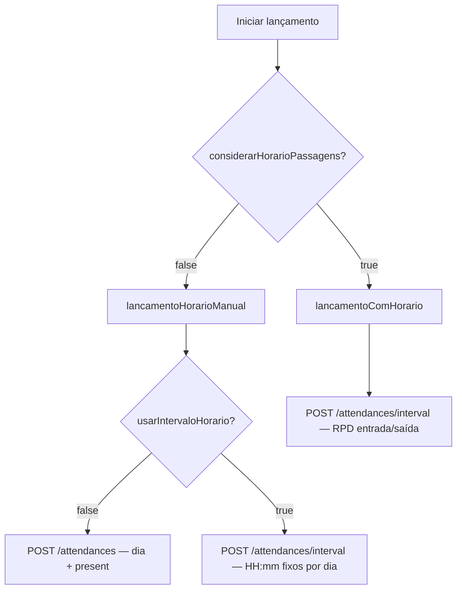

# Envio de Frequências ao ERP (Gennera)

**Versão:** 0.2 (status ENVIADO/ERRO mantidos)  
**Data:** 2026-05-22  
**Escopo:** `webapi`, `webapp`  
**Prioridade:** **Fase 7** do plano (envio manual; Fase 8 = sync agendado — ver [sync-freq-educacional.md](./sync-freq-educacional.md))  
**Relacionado:** [manutencao-registros.md](./manutencao-registros.md) · [README](./README.md) · [sync-freq-educacional.md](./sync-freq-educacional.md)

---

## 1. Objetivo

Evoluir o fluxo **Administrar Frequências** (`AdminLancamentoModal`) para:

1. Filtrar pessoas-alvo também por **Curso, Série e Turma** (padrão matrículas).
2. Tratar ERPs não-Gennera com mensagem *“em breve”*.
3. Refinar status e persistência de resposta da API Gennera por RPD.
4. Suportar **intervalo de horário fixo** quando não usar horários das passagens/RPDs.
5. Renomear e reestruturar métodos no `GenneraAttendanceService`.

---

## 2. Contexto atual

| Item | Situação hoje |
|------|----------------|
| Modal | `AdminLancamentoModal.tsx` — pessoas (multi), datas, checkbox horário, switch presença/falta |
| ERP não-Gennera | Aviso amarelo: “apenas Gennera suportado” |
| API | `POST .../gennera/lancamento` + job Redis |
| `considerarHorarioPassagens=true` | `lancamentoComHorario` → `/attendances/interval` com RPD entrada/saída + tolerâncias |
| `considerarHorarioPassagens=false` | `lancamentoSemHorario` → `/attendances` presença/falta por dia |
| Status RPD | `PENDENTE`, `ENVIADO`, `ERRO`, `MANUAL` |
| Resposta API | `RPDResult` Json (sucesso e erro) |
| Multi-janela | `lancamentoComHorario` assume **1 RPD/pessoa/dia** (Map) — precisa evoluir (Fase 6) |

---

## 3. ERP não-Gennera

Ao abrir **Administrar Frequências**, se `ERPConfig.ERPSistema !== 'Gennera'`:

- Exibir mensagem informativa (não erro):
  > *“O envio de frequências para o ERP **{nome}** será disponibilizado em breve. No momento, esta funcionalidade está disponível apenas para **Gennera**.”*
- Ocultar formulário de processamento.
- **Todas** as regras abaixo aplicam-se **somente a Gennera**.

---

## 4. Filtros do modal (webapp)

Arquivo: `AdminLancamentoModal.tsx`

### 4.1 Filtros de escopo de pessoas

| Filtro | Componente | Comportamento |
|--------|------------|---------------|
| Pessoas | `PessoaInstituicaoAsyncMultiSelect` (existente) | Vazio = todas |
| Curso | `SearchableMultiSelect` | Igual `MatriculasFiltros` |
| Série | `SearchableMultiSelect` | Idem |
| Turma | `SearchableMultiSelect` | Idem |

Carregar opções: `GET /instituicao/:id/matricula/opcoes-filtro`.

**Resolução de alvos (API):** união de critérios:

- Se `pessoasCodigos[]` informado → restringe a essas pessoas.
- Se curso/série/turma informados → pessoas com matrícula ativa matching (`MATAtivo=true`).
- Combinação = **interseção** entre pessoa explícita e filtros de matrícula.

Exemplo preview no modal (opcional): *“Serão processadas **N** pessoas”* após blur dos filtros (`POST .../gennera/lancamento/preview-count` ou incluir no confirm).

### 4.2 DTO estendido

```typescript
export class IniciarLancamentoGenneraDto {
  pessoasCodigos?: number[];
  cursos?: string[];
  series?: string[];
  turmas?: string[];

  dataInicio: string;  // ISO date
  dataFim: string;

  considerarHorarioPassagens: boolean;

  // Somente quando considerarHorarioPassagens = false
  lancaPresenca?: boolean;
  usarIntervaloHorario?: boolean;      // novo
  horaEntradaIntervalo?: string;       // HH:mm, fuso instituição — obrigatório se usarIntervaloHorario
  horaSaidaIntervalo?: string;         // HH:mm — obrigatório se usarIntervaloHorario
}
```

---

## 5. Matriz de modos de envio (Gennera)



| considerarHorarioPassagens | usarIntervaloHorario | Método service | Endpoint Gennera |
|----------------------------|----------------------|----------------|------------------|
| `true` | — | `lancamentoComHorario` | `/persons/{id}/attendances/interval` (RPD ± tolerância) |
| `false` | `false` | `lancamentoHorarioManual` → ramo presença | `/persons/{id}/attendances` |
| `false` | `true` | `lancamentoHorarioManual` → ramo intervalo fixo | `/persons/{id}/attendances/interval` (horários informados) |

**Renomeação:** `lancamentoSemHorario` → **`lancamentoHorarioManual`** (refatoração interna; comportamento expandido com segundo checkbox).

---

## 6. Modo A — `considerarHorarioPassagens = true`

Método: **`lancamentoComHorario`** (ajustes).

### 6.1 Seleção de RPDs

- Por `(pessoa, dia)` no intervalo, considerar **todas** as janelas (`RPDJanelaIndice` 1..N).
- **Ignorar** RPD com `RPDDataEntrada == null` **ou** `RPDDataSaida == null`.
- Cada janela válida = **1 chamada** `/attendances/interval`.

### 6.2 Payload

```typescript
{
  startDate: RPDDataEntrada - INSToleranciaEntradaMinutos,
  endDate: RPDDataSaida + INSToleranciaSaidaMinutos,
  present: true,
  justification: '',
}
```

### 6.3 Status por RPD

| Resultado | RPDStatus | Persistência |
|-----------|-----------|--------------|
| Sucesso HTTP | **`ENVIADO`** | Não gravar response (`RPDResponseRequest = null`; não preencher `RPDResult`) |
| Falha HTTP / validação | **`ERRO`** | Gravar corpo em **`RPDResponseRequest`** |
| Sem PESIdExterno | **`ERRO`** | `RPDResponseRequest: { error: 'PESIdExterno não configurado' }` |

**Retry:** processar RPDs em **`PENDENTE`** e **`ERRO`**; pular **`ENVIADO`**.

---

## 7. Modo B — `considerarHorarioPassagens = false`

Método: **`lancamentoHorarioManual`** (ex-`lancamentoSemHorario`).

### 7.1 UI adicional (quando checkbox horário passagens desmarcado)

1. **Switch Presença / Falta** (existente) — `lancaPresenca`.
2. **Novo checkbox:** *“Enviar intervalo de horário fixo”* → `usarIntervaloHorario`.
3. Se `usarIntervaloHorario = true`:
   - Campos obrigatórios: **Hora entrada** e **Hora saída** (`HH:mm`, fuso `INSFusoHorario`).
   - Desabilita impacto do switch presença no endpoint de intervalo (`present: true` no interval).

### 7.2 Ramo B1 — sem intervalo (`usarIntervaloHorario = false`)

Por `(pessoa, dia)`:

```typescript
POST /persons/{PESIdExterno}/attendances
{
  date: 'YYYY-MM-DD',  // RPDData
  present: lancaPresenca,
  justification: '',
}
```

- Não exige RPD pré-existente (pode criar RPD `MANUAL` se ausente — comportamento atual).
- Status: **`ENVIADO`** / **`ERRO`** + `RPDResponseRequest` apenas em falha.

### 7.3 Ramo B2 — com intervalo fixo (`usarIntervaloHorario = true`)

Por `(pessoa, dia)`:

- Montar `startDate` / `endDate` combinando `RPDData` + `horaEntradaIntervalo` / `horaSaidaIntervalo` (fuso instituição).
- Validar: hora saída > hora entrada (ou permitir overnight — **default:** mesmo dia, saída after entrada).

```typescript
POST /persons/{PESIdExterno}/attendances/interval
{
  startDate: ISO,
  endDate: ISO,
  present: true,
  justification: '',
}
```

- **1 chamada por pessoa/dia** (não por janela RPD).
- Status por RPD associado ao dia (criar/atualizar 1 linha `RPDJanelaIndice=1` se necessário para rastrear status).

---

## 8. Schema — status e response

### 8.1 Enum `RPDStatus` — **sem alteração**

Manter nomenclatura atual:

```prisma
enum RPDStatus {
  PENDENTE
  ENVIADO   // envio Gennera OK
  ERRO      // envio Gennera com falha
  MANUAL
}
```

| Situação | Status |
|----------|--------|
| Aguardando envio / recém-agregado | `PENDENTE` |
| Gennera OK | `ENVIADO` |
| Gennera falhou | `ERRO` |
| Criado manualmente (sem envio) | `MANUAL` |

### 8.2 Campo `RPDResponseRequest` (novo)

```prisma
/// Resposta da API Gennera em caso de falha (null em sucesso).
RPDResponseRequest Json?
```

**Regras:**

- Sucesso → `RPDStatus = ENVIADO`, **`RPDResponseRequest = null`**. Não gravar response de sucesso (deixar de popular `RPDResult` no fluxo Gennera — hoje grava em sucesso; **ajustar** para null).
- Falha → `RPDStatus = ERRO`, **`RPDResponseRequest = err.response.data ?? { message }`**.
- `RPDResult` permanece no schema para compatibilidade legada; fluxo Gennera Fase 7 usa **`RPDResponseRequest`** só em erro.

### 8.3 Webapp — badges

Manter labels atuais em `registros/page.tsx`:

| Status | Label UI |
|--------|----------|
| PENDENTE | Pendente |
| ENVIADO | Enviado |
| ERRO | Erro |
| MANUAL | Manual |

---

## 9. Resolução de pessoas-alvo (service)

Extrair helper reutilizável:

```typescript
async resolvePessoasAlvoGennera(
  instituicaoCodigo: number,
  dto: IniciarLancamentoGenneraDto,
): Promise<{ PESCodigo: number; PESIdExterno: string | null }[]>
```

Lógica:

1. Base: pessoas ativas, `deletedAt: null`, da instituição.
2. Filtro `pessoasCodigos` se presente.
3. Filtro matrícula: `matriculas.some { MATAtivo, MATCurso in cursos?, ... }`.
4. Ordenar por `PESCodigo`.

---

## 10. Refatoração `GenneraAttendanceService`

```typescript
private async runLancamento(...) {
  if (dto.considerarHorarioPassagens) {
    await this.lancamentoComHorario(...);
  } else {
    await this.lancamentoHorarioManual(...);  // ex lancamentoSemHorario
  }
}

private async lancamentoHorarioManual(...) {
  if (dto.usarIntervaloHorario) {
    await this.lancamentoIntervaloFixo(...);   // novo ramo privado
  } else {
    await this.lancamentoPresencaDia(...);     // ex corpo de lancamentoSemHorario
  }
}

private async aplicarResultadoGennera(
  rpdCodigo: number,
  ok: boolean,
  responseBody?: unknown,
  errorBody?: unknown,
) {
  if (ok) {
    await update({ RPDStatus: ENVIADO, RPDResponseRequest: null, RPDResult: null });
  } else {
    await update({ RPDStatus: ERRO, RPDResponseRequest: errorBody });
  }
}
```

---

## 11. Webapp — UI do modal (wireframe)

```
┌─ Administrar Frequência ─────────────────────────────────┐
│ [Aviso Gennera / Em breve para outro ERP]                │
│ Pessoas (multi)                                          │
│ Curso ▼   Série ▼   Turma ▼   (SearchableMultiSelect)    │
│ Data início *    Data fim *                              │
│ ☑ Considerar horário das passagens (RPD entrada/saída)  │
│                                                          │
│ (se desmarcado:)                                         │
│   Lançar: [Presença ◉━━━━ Falta]                        │
│   ☐ Enviar intervalo de horário fixo                     │
│   (se intervalo:) Hora entrada *  Hora saída *           │
│                                                          │
│ [Processar] [Cancelar]                                   │
└──────────────────────────────────────────────────────────┘
```

Validação client-side:

- Datas obrigatórias.
- Se `!considerarHorario && usarIntervaloHorario` → horas obrigatórias.
- Se nenhum filtro pessoa/curso/série/turma → todas as pessoas (com confirmação explícita no modal).

---

## 12. API

| Método | Rota | Descrição |
|--------|------|-----------|
| POST | `/registro-diario/gennera/lancamento` | Body estendido (filtros matrícula + intervalo) |
| GET | `/registro-diario/gennera/lancamento/:jobId` | Inalterado |

Opcional: `POST .../gennera/lancamento/contagem-alvos` → `{ total: number }`.

---

## 13. Testes manuais

- [ ] ERP Totvs → mensagem “em breve”, sem form.
- [ ] Gennera + curso X → só matriculados no curso.
- [ ] Horário passagens=true, RPD com entrada null → skip, status inalterado.
- [ ] Horário passagens=true, 3 janelas/dia → 3 POST interval.
- [ ] Sucesso → `ENVIADO`, `RPDResponseRequest` null.
- [ ] Erro Gennera → `ERRO`, body em `RPDResponseRequest`.
- [ ] Horário passagens=false, sem intervalo → `/attendances` presença/falta.
- [ ] Horário passagens=false, com intervalo 08:00–12:00 → `/attendances/interval` por dia.

---

## 14. Dependências

Implementar **após**:

- Fase 1 (schema RPD multi-janela + status)
- Fase 6 (Gennera multi-janela em `lancamentoComHorario`)

Pode ser **Fase 7** isolada se schema de status/`RPDResponseRequest` já estiver na Fase 1.
