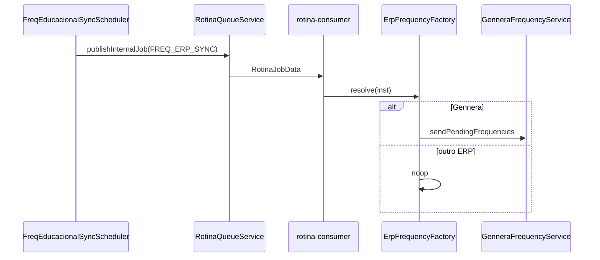

# Sincronização agendada — Frequências ao ERP educacional

**Versão:** 0.1  
**Data:** 2026-05-22  
**Escopo:** `webapi`, `webapp`, `worker`  
**Prioridade:** **Fase 8** (após Fase 7 — modal Gennera manual; compartilha factory/serviço Gennera no worker)  
**Relacionado:** [gennera-frequencias.md](./gennera-frequencias.md) · [README](./README.md) · [worker.md](./worker.md)

---

## 1. Objetivo

Agendar envio automático de **RPDs** (`RPDRegistrosDiarios`) ao sistema de gestão educacional (ERP), espelhando o padrão já existente de **Sincronização de Registros Diários** (`INSSyncRegistrosDiarios` + `INSTempoSync`).

| Etapa | Responsável | Ação |
|-------|-------------|------|
| Configuração | WebApp settings | Checkbox + cron por instituição |
| Agendamento | WebAPI (`@nestjs/schedule`) | Cron enfileira job **INTERNAL** no RabbitMQ |
| Processamento | Worker | Factory por ERP → Gennera envia; demais = no-op |
| Critério RPD | Worker | Status **≠ ENVIADO**, com entrada **e** saída preenchidas |
| Horários | Worker | Tolerâncias `INSToleranciaEntradaMinutos` / `INSToleranciaSaidaMinutos` |

---

## 2. Schema — `INSInstituicao`

Arquivo: `webapi/prisma/schema.prisma` (replicar em `worker/prisma/schema.prisma` via `npm run prisma:sync`).

Adicionar após `INSSyncRegistrosDiarios` / `INSTempoSync`:

```prisma
/// Ativa envio agendado de frequências (RPD) ao ERP educacional.
INSSyncFreqEducacional    Boolean @default(false)

/// Cron (5 ou 6 campos, mesmo padrão INSTempoSync) para envio diário ao ERP.
/// Default: 23:58 todo dia → "58 23 * * *" (5 campos) ou "0 58 23 * * *" (6 campos legado).
INSTempoFreqEducacional   String  @default("58 23 * * *")
```

| Campo | Tipo | Default | Significado |
|-------|------|---------|-------------|
| `INSSyncFreqEducacional` | Boolean | `false` | Liga/desliga agendamento |
| `INSTempoFreqEducacional` | String | `"58 23 * * *"` | Diariamente às **23:58** (horário do servidor cron) |

> **Nome do PO:** `INSTmpFreqEducacional` → adotar **`INSTempoFreqEducacional`** por consistência com `INSTempoSync`.

**Migration sugerida:** `20260522120000_add_freq_educacional_sync`

```sql
ALTER TABLE "INSInstituicao"
  ADD COLUMN "INSSyncFreqEducacional" BOOLEAN NOT NULL DEFAULT false,
  ADD COLUMN "INSTempoFreqEducacional" TEXT NOT NULL DEFAULT '58 23 * * *';
```

---

## 3. WebApp — settings instituição

**Arquivo:** `webapp/src/app/(admin)/settings/institutions/[id]/page.tsx`  
**Posição:** imediatamente **abaixo** do card *Sincronização de Registros Diários* (~linha 641).

### 3.1 ComponentCard (espelho do sync RPD)

**Título:** *Sincronização de Frequências ao ERP*  
**Descrição:** *Agendamento automático de envio de registros diários (RPD) ao sistema de gestão educacional.*

| Controle | State React | Campo Prisma |
|----------|-------------|--------------|
| Checkbox ativo | `syncFreqEducacional` | `INSSyncFreqEducacional` |
| `CronBuilder` | `tempoFreqEducacional` | `INSTempoFreqEducacional` |

Comportamento idêntico ao card de registros diários: cron desabilitado visualmente quando checkbox off.

**Nota UI:** se ERP ≠ Gennera, o card permanece configurável; o worker fará no-op até a integração existir.

### 3.2 Load / Save

```typescript
setSyncFreqEducacional(instRes.INSSyncFreqEducacional ?? false);
setTempoFreqEducacional(instRes.INSTempoFreqEducacional ?? "58 23 * * *");

// PUT /instituicoes/:id
INSSyncFreqEducacional: syncFreqEducacional,
INSTempoFreqEducacional: tempoFreqEducacional,
```

### 3.3 Wireframe

```
┌─────────────────────────────────────────────────────────┐
│ Sincronização de Frequências ao ERP                      │
├─────────────────────────────────────────────────────────┤
│ ☑ Ativar sincronização automática de frequências ao ERP │
│ Agendamento (Cron): [ CronBuilder — 58 23 * * * ]       │
└─────────────────────────────────────────────────────────┘
```

---

## 4. API — scheduler

**Novo arquivo:** `webapi/src/registro-diario/freq-educacional-sync.scheduler.ts`  
**Padrão:** copiar `registro-diario-sync.scheduler.ts`.

| Aspecto | Registros diários | Frequências ERP |
|---------|-------------------|-----------------|
| Flag | `INSSyncRegistrosDiarios` | `INSSyncFreqEducacional` |
| Cron | `INSTempoSync` | `INSTempoFreqEducacional` |
| Job name | `rpd-sync-{inst}` | `freq-erp-sync-{inst}` |
| Lock Redis | `rpd:sync:cron:lock:{inst}` | `freq:erp:sync:cron:lock:{inst}` |
| Pré-checagem | `REGProcessado=false` | `RPDStatus != ENVIADO` + entrada/saída |
| `internalKind` | `RPD_AGGREGATION` | `FREQ_ERP_SYNC` |

### 4.1 `onTick`

```typescript
const count = await prisma.rPDRegistrosDiarios.count({
  where: {
    INSInstituicaoCodigo: instCodigo,
    RPDStatus: { not: RPDStatus.ENVIADO },
    RPDDataEntrada: { not: null },
    RPDDataSaida: { not: null },
  },
});

if (count > 0) {
  await queueService.publishInternalJob(instCodigo, 'FREQ_ERP_SYNC');
}
```

**Default:** só enfileira se `count > 0`. RPDs incompletos não entram na contagem.

### 4.2 Redis refresh

Reutilizar `channelSyncSchedulerRefresh()` — ambos schedulers reconciliam ao salvar settings.

---

## 5. Payload INTERNAL — discriminação de tipo

Hoje todo job `trigger: 'INTERNAL'` cai em `processRegistroDiarioAggregation`. Estender:

```typescript
// webapi + worker — rotina/queue/rotina-job.dto.ts
export type InternalJobKind =
  | 'RPD_AGGREGATION'   // passagens → RPD (worker)
  | 'FREQ_ERP_SYNC';    // RPD → ERP educacional (worker)

export interface RotinaJobData {
  exeId: string;
  rotinaCodigo: number;
  instituicaoCodigo: number;
  trigger: 'SCHEDULE' | 'WEBHOOK' | 'INTERNAL';
  /** Obrigatório quando trigger === 'INTERNAL'. Jobs legados sem campo → RPD_AGGREGATION. */
  internalKind?: InternalJobKind;
  requestEnvelope?: unknown;
  enqueuedAt: string;
}
```

Futuros tipos (ex.: `LOG_CLEANUP`, `HARDWARE_POLL`) seguem o mesmo enum.

### 5.1 `RotinaQueueService`

```typescript
async publishInternalJob(instituicaoCodigo: number, kind: InternalJobKind): Promise<string>
async publishRegistroDiarioSyncJob(inst)  // → RPD_AGGREGATION
async publishFreqEducacionalSyncJob(inst) // → FREQ_ERP_SYNC
```

---

## 6. Worker — roteamento INTERNAL

**Arquivo:** `worker/src/rotina-consumer.ts`

```typescript
if (data.trigger === 'INTERNAL') {
  const kind = data.internalKind ?? 'RPD_AGGREGATION';
  switch (kind) {
    case 'RPD_AGGREGATION':
      await this.processRegistroDiarioAggregation(data.instituicaoCodigo);
      break;
    case 'FREQ_ERP_SYNC':
      await this.erpFrequencySync.run(data.instituicaoCodigo);
      break;
  }
}
```

---

## 7. Worker — factory e `GenneraFrequencyService`

### 7.1 Pastas

```
worker/src/erp-frequency/
  erp-frequency.types.ts
  erp-frequency.factory.ts
  erp-frequency-sync.orchestrator.ts
  brands/gennera/gennera-frequency.service.ts
  brands/noop/noop-frequency.provider.ts
```

### 7.2 Factory

- Lê `ERPConfiguracao` da instituição.
- `ERPSistema === 'Gennera'` + `ERPUrlBase` → `GenneraFrequencyService`.
- Qualquer outro ERP ou config ausente → **noop** (log + retorno zerado, job OK).

### 7.3 Lógica Gennera (espelho `lancamentoComHorario`)

Referência: `webapi/src/registro-diario/gennera-attendance.service.ts` linhas 112–209.

1. Carregar tolerâncias `INSToleranciaEntradaMinutos` / `INSToleranciaSaidaMinutos` (default 15).
2. Buscar RPDs: `RPDStatus != ENVIADO`, entrada e saída não nulas.
3. Por RPD: `startDate = entrada - tolEntrada`, `endDate = saída + tolSaida`.
4. POST `/persons/{PESIdExterno}/attendances/interval` com `present: true`.
5. Atualizar `RPDStatus` → `ENVIADO` ou `ERRO`; gravar `RPDResult`.

**Multi-janela (pós-Fase 6):** uma chamada Gennera por linha RPD.

---

## 8. DTO instituição

Em `instituicao.dto.ts`: `INSSyncFreqEducacional`, `INSTempoFreqEducacional` com validação `CRON_5_OR_6_FIELDS`.

---

## 9. Fase 7 vs Fase 8

| Aspecto | Fase 7 — Manual | Fase 8 — Agendado |
|---------|-----------------|-------------------|
| Disparo | Usuário + `GenneraAttendanceService` (WebAPI) | Cron + Worker |
| Escopo | Filtros data/pessoas/curso | Todos RPD ≠ ENVIADO |
| Modo sem horário | Sim (`lancamentoSemHorario`) | **Não** |
| ERP não-Gennera | UI “em breve” | No-op no worker |

Ver [gennera-frequencias.md](./gennera-frequencias.md) para Fase 7.

---

## 10. Diagrama



---

## 11. Testes manuais

- [ ] Default cron `58 23 * * *`
- [ ] Card settings salva + reconcilia scheduler
- [ ] Tick enfileira `internalKind: FREQ_ERP_SYNC`
- [ ] Gennera envia PENDENTE/ERRO; ignora ENVIADO
- [ ] Totvs/Lyceum → noop, job OK
- [ ] Tolerâncias em startDate/endDate
- [ ] Job legado sem `internalKind` → RPD_AGGREGATION

---

## 12. Checklist de arquivos

**webapi:** schema + migration, DTO, `freq-educacional-sync.scheduler.ts`, `registro-diario.module.ts`, `rotina-job.dto.ts`, `rotina-queue.service.ts`

**webapp:** `settings/institutions/[id]/page.tsx`

**worker:** `rotina-job.dto.ts`, `rotina-consumer.ts`, `erp-frequency/**`, schema sync
